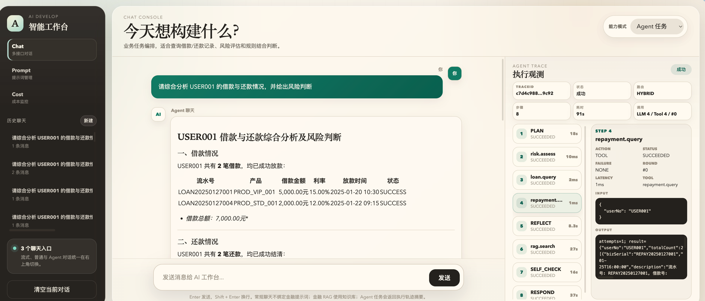
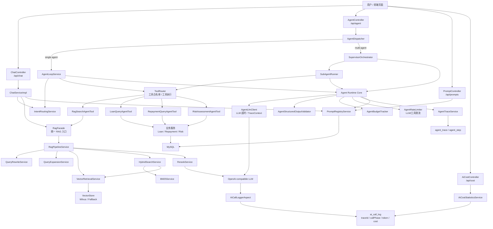

# AI Credit Assistant — 智能金融信贷助手

基于 Spring Boot 3.3 + Spring AI 1.1.6 的 AI 应用工程化实践项目。以金融信贷为业务场景，覆盖常规 Chat、统一 RAG、Function Calling、Agent Loop、多 Agent Supervisor、Prompt 治理、成本观测与 Agent Trace 持久化。



## 背景与动机

这是一次围绕 **Spring AI 工程化落地** 的个人技术实践，目标是把「RAG 与 Multi-Agent 如何在大体量 Java 后端里工程化」真正走通，并形成自己的架构判断，而不是停留在调通一个 Demo。

- **定位**：技术验证与架构演示，**非生产系统**。所有能力均为可运行的工程化样例，但不对接真实金融业务与数据。
- **时间**：2026 年中集中投入的一段时间（详见 Commits），作为对 Spring AI 1.1 系列的体系化学习产出。
- **为什么做**：市面上的 Spring AI 示例多为单点片段，缺少把 Chat / RAG / Agent / 可观测串成一条后端主链路的完整参考。本项目试图补上这块空白，也作为后续可复用的脚手架。

> 说明：本项目用于展示工程化思路与代码组织，请勿将其等同于生产经验。架构取舍与边界在 [架构讲解与追问准备](docs/architecture/interview-guide.md) 中有专门说明。

## 核心定位

这不是一个简单的聊天接口 Demo，而是一个把 AI 能力当作**一等后端服务**来组织的工程化样例：

- `Chat`：支持 `general`、`financial_rag`、`auto` 三种模式。
- `RAG`：通过 `RagFacade` 统一 Chat 与 Agent 的知识库检索入口。
- `Agent Runtime`：提供 Plan、Tool、Reflect、Replan、Respond、SelfCheck 的执行闭环。
- `Multi-Agent`：通过 Supervisor 调度多个职责明确的子 Agent。
- `Prompt Registry`：支持提示词草稿、发布、回滚和按环境读取。
- `Observability`：记录 LLM 调用成本，并通过 `traceId` 关联 Agent 执行链路。

## 当前架构



## 能力矩阵

| 能力 | 说明 | 关键类 |
|---|---|---|
| 常规聊天 | 通用问答，不启用金融 RAG 和业务工具 | `ChatServiceImpl`, `ChatMode` |
| 金融 RAG | 金融知识库问答，通过统一 Facade 检索证据 | `RagFacade`, `RagPipelineService` |
| Function Calling | 业务查询与风控工具 | `LoanQueryAgentTool`, `RepaymentQueryAgentTool`, `RiskAssessmentAgentTool` |
| Agent Loop | 规划、工具执行、反思、重规划、自检、响应 | `AgentLoopService` |
| 多 Agent | Supervisor 调度子 Agent，共享上下文并综合结果 | `AgentDispatcher`, `SupervisorOrchestrator`, `SubAgentRunner` |
| Prompt 治理 | 提示词版本、发布、回滚 | `PromptRegistryService` |
| 成本观测 | 拦截 Chat/Embedding 调用，记录 token、耗时、成本 | `AiCallLoggerAspect`, `AiCostStatisticsService` |
| Trace 回放 | 持久化 Agent 执行头和步骤明细 | `AgentTraceService`, `agent_trace`, `agent_step` |

## 关键接口

| 接口 | 功能 |
|---|---|
| `POST /api/chat` | 阻塞式 Chat |
| `POST /api/chat/stream` | SSE 流式 Chat，支持 `general` / `financial_rag` / `auto` |
| `POST /api/agent/chat` | 单 Agent 或多 Agent 任务执行 |
| `GET /api/agent/trace/{traceId}` | 查询 Agent 执行 Trace |
| `GET /api/chat/conversations` | 查询会话列表 |
| `GET /api/chat/{conversationId}/messages` | 查询会话消息 |
| `GET/POST /api/prompts/registry/*` | Prompt Registry 管理 |
| `GET /api/cost/*` | 成本统计 |

说明：RAG 作为内部能力封装，不单独暴露调试入口，通过 `RagFacade` 被 Chat 和 Agent 复用。

## 技术栈

| 层次 | 技术 |
|---|---|
| 后端框架 | Spring Boot 3.3.5 |
| AI 框架 | Spring AI 1.1.6 |
| 语言 | Java 17 |
| AI 接入 | OpenAI-compatible Chat / Embedding |
| 向量存储 | Milvus VectorStore，未启用时使用空结果降级实现 |
| 持久化 | MySQL + Spring Data JPA |
| API 文档 | SpringDoc + Knife4j |
| 前端 | Spring Boot Static HTML/CSS/JS |
| 可观测 | AOP 调用日志、成本统计、Agent Trace |

## 项目结构

```text
src/main/java/com/example/aidevelop/
├── agent/
│   ├── controller/        # Agent API
│   ├── model/             # Agent 请求、响应、步骤、状态、失败原因
│   ├── multi/             # Supervisor、多 Agent、Agent-as-Tool
│   ├── service/           # Agent Runtime、LLM Client、Trace、Planner/Reflector/Responder
│   └── tool/              # Agent 工具适配器
├── config/                # Spring AI、RAG、路由、Agent、HTTP 配置
├── controller/            # Chat、Prompt、Cost、Health 等 API
├── interceptor/           # AI 调用日志 AOP
├── model/
│   ├── dto/               # API DTO
│   ├── entity/            # JPA 实体
│   └── rag/               # 统一 RAG 请求/响应模型
├── repository/            # Spring Data JPA Repository
├── scheduled/             # 成本统计调度任务
└── service/
    ├── business/          # 贷款、还款、风控业务服务
    ├── cost/              # 成本计算与统计
    ├── function/          # Spring AI @Tool 函数
    ├── impl/              # ChatService 实现
    ├── prompt/            # Prompt Registry
    └── rag/               # RagFacade 与 RAG Pipeline
```

## 数据库脚本

| 脚本 | 内容 |
|---|---|
| `sql/demo_tables.sql` | 业务演示数据表 |
| `sql/chat_memory.sql` | 会话消息表 |
| `sql/ai_cost_tracking.sql` | AI 调用日志与成本统计表 |
| `sql/agent_trace.sql` | Agent trace 与步骤明细表 |
| `sql/prompt_registry.sql` | Prompt Registry 表和初始化数据 |

## 文档索引

| 文档 | 内容 |
|---|---|
| [项目文档入口](docs/README.md) | 文档结构、推荐阅读顺序和完整索引 |
| [架构讲解与追问准备](docs/architecture/interview-guide.md) | 项目介绍、亮点、架构取舍和追问准备 |
| [架构总览](docs/architecture/overview.md) | 当前系统架构、Chat/RAG/Agent/Prompt/Cost 总览 |
| [Agent Loop](docs/architecture/agent-loop.md) | Agent Runtime、步骤状态、失败分类和 trace |
| [多 Agent](docs/architecture/multi-agent.md) | Supervisor、SubAgent、Agent-as-Tool |
| [演进路线](docs/architecture/evolution-roadmap.md) | 后续可优化方向 |
| [快速开始](docs/guides/quick-start.md) | 环境变量、数据库初始化、启动方式 |
| [Chat 指南](docs/guides/chat.md) | Chat 模式、流式响应、会话管理 |
| [RAG 指南](docs/guides/rag.md) | RagFacade、RAG Pipeline、知识库构建 |
| [Function Calling](docs/guides/function-calling.md) | 工具函数和业务工具 |
| [Prompt 工程](docs/guides/prompt-engineering.md) | Prompt Registry 和版本治理 |
| [成本观测](docs/guides/cost-observability.md) | AI 调用日志、成本统计、traceId 关联 |
| [执行链路示例](docs/examples/execution-flows.md) | 核心请求链路走读 |
