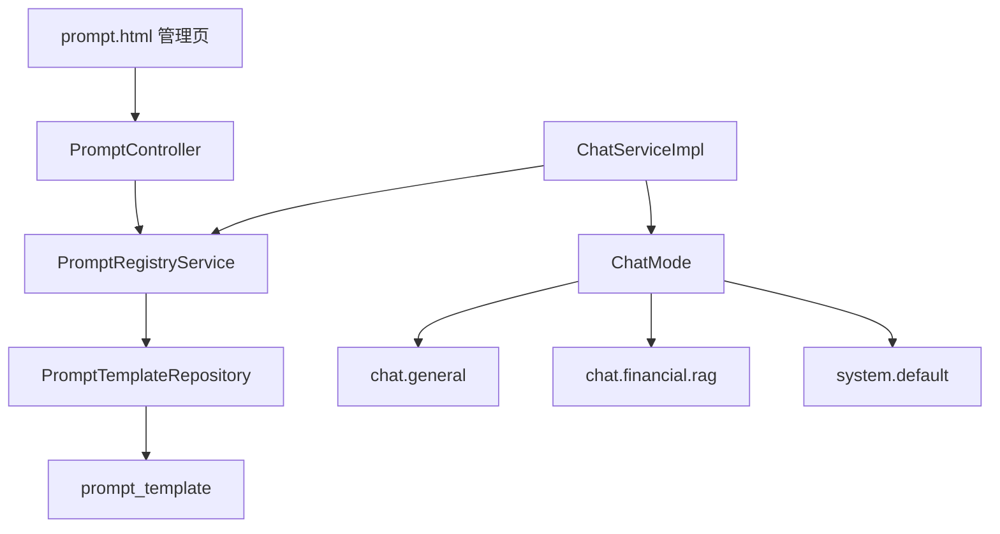
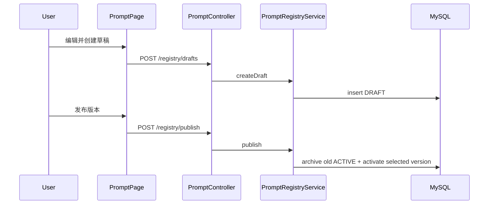

# 04 - Prompt 工程：模板管理与系统提示词设计

## 1. 核心概念

### System Prompt vs User Prompt

- **System Prompt**：定义 AI 的角色、行为规则和约束，在每次对话中保持不变
- **User Prompt**：用户实际输入的问题或指令

系统提示词决定了 AI 回答的质量和方向，是 Prompt Engineering 中最重要的部分。

### Prompt 模板治理的作用

- **外部化**：提示词从代码中分离，修改不需要重新编译
- **版本化**：可以追踪提示词的变更历史
- **发布治理**：草稿、发布、回滚全流程可控

### 常用 Prompt Engineering 技巧

| 技巧 | 说明 | 适用场景 |
|------|------|---------|
| Role-playing | 给 AI 设定专业角色 | 专业领域问答 |
| Few-shot | 提供几个示例 | 格式化输出、特定风格 |
| CoT (Chain of Thought) | 引导逐步推理 | 复杂逻辑问题 |
| 约束条件 | 限定回答范围和格式 | 避免跑题、控制输出 |

## 2. 本项目的 Prompt 架构



Prompt 不再在 `AiModelConfig` 中作为 `defaultSystem` 写入 `ChatClient.Builder`。原因是系统现在同时支持常规聊天和金融 RAG，如果全局写死金融提示词，普通问题也会被模型理解成金融助贷问题。当前由 `ChatServiceImpl` 在每次请求时根据 `ChatMode` 动态选择 prompt。

### PromptProperties

将 `application.yml` 中的 `app.prompts.*` 配置绑定到 Java 对象：

```yaml
app:
  prompts:
    enabled: true
    registry-enabled: true
    env: dev
```

### PromptService 与 PromptRegistryService

核心职责：
1. 只读取 Prompt Registry 中当前 `ACTIVE` 版本
2. 对历史兼容链路保持严格读取，未命中时阻断误用
3. 通过 API 完成草稿、发布、回滚等版本化管理
4. 为 `chat.general` 和 `chat.financial.rag` 提供代码级兜底，避免数据库尚未执行新 SQL 时聊天直接不可用

`PromptService` 负责老接口的只读访问；`PromptRegistryService` 负责版本治理和新模式提示词读取。执行 `sql/prompt_registry.sql` 后，运行时优先读取数据库中的 `ACTIVE` 版本。

### Prompt Registry 数据模型（最小版）

新增两张表：

- `prompt_template`：存储模板内容和版本状态
- `prompt_publish_log`：记录发布和回滚动作

状态流转：

```
DRAFT -> ACTIVE -> ARCHIVED
```

同一个 `prompt_key + env` 只有一个 `ACTIVE` 版本。

## 3. 系统提示词设计实战

### 设计原则

1. **明确角色定位**：告诉 AI "你是谁"
2. **界定能力边界**：说明 AI 能做什么、不能做什么
3. **提供决策框架**：帮助 AI 判断不同场景的应对策略
4. **设定输出格式**：规范回答的结构和风格

### 本项目的系统提示词分析

项目目前有三类主要运行时提示词：

| promptKey | 使用场景 | 设计目标 |
|-----------|----------|----------|
| `chat.general` | 常规聊天 | 中立助手，不强行进入金融助贷语境 |
| `chat.financial.rag` | 金融 RAG | 基于知识库回答借款、还款、风控、产品规则 |
| `system.default` | 自动路由兼容链路 | 保留旧的 Tool/RAG/Hybrid 决策策略 |

`system.default` 根据用户问题类型设计了 4 种决策策略：

```
场景 1: 纯规则类问题（如"逾期怎么处理"）
  -> 直接从知识库检索回答，不调用函数

场景 2: 纯数据类问题（如"查一下贷款 LN001"）
  -> 调用函数查询数据库，用真实数据回答

场景 3: 混合类问题（如"这笔贷款逾期了怎么办"）
  -> 先查数据，再结合规则知识回答

场景 4: 假设/通用问题（如"贷款利率一般是多少"）
  -> 给出一般性建议，提示以实际为准
```

### 不同模型的 Prompt 差异

- **DeepSeek/智谱AI**：提示词较短，模型能较好理解隐含意图
- **GLM（OpenAI 兼容）**：提示词建议保持结构化，包含清晰的决策指令和输出格式要求

这反映了不同模型对指令粒度的需求不同，实际项目中需要针对使用的模型调整。

## 4. Prompt 模板存储

Prompt 内容统一存储在 `prompt_template` 表中，通过 `prompt_key + env + version` 管理版本与发布状态。

## 5. Prompt 管理 API

| 方法 | 路径 | 说明 |
|------|------|------|
| GET | `/api/prompts/system` | 查看当前 System 提示词 |
| GET | `/api/prompts/rag/qa` | 查看 RAG QA 提示词 |
| GET | `/api/prompts/function/calling` | 查看 Function Calling 提示词 |
| GET | `/api/prompts/status` | 查看全部提示词状态 |
| POST | `/api/prompts/registry/drafts` | 创建草稿版本 |
| POST | `/api/prompts/registry/publish` | 发布指定版本为 ACTIVE |
| POST | `/api/prompts/registry/rollback` | 回滚到指定历史版本 |
| GET | `/api/prompts/registry/active` | 查询当前生效版本 |
| GET | `/api/prompts/registry/versions` | 查询版本历史列表 |

Prompt 的生效方式为：创建草稿版本 -> 发布为 `ACTIVE`，无需重启应用。

### Prompt 管理页

`src/main/resources/static/prompt.html` 提供可视化管理入口，当前会展示：

- `system.default`
- `chat.general`
- `chat.financial.rag`
- `rag.qa`
- `function.calling`



## 6. 动手实验

### 实验 1：创建并发布新的 System Prompt 版本

在 `POST /api/prompts/registry/drafts` 的 `content` 中使用下列文本创建草稿：

```
你是一个严格的金融合规审查员。在回答任何问题时，你必须：
1. 先判断问题是否涉及合规风险
2. 对有风险的操作给出明确的警告
3. 引用相关的监管规定
...
```

然后调用 `POST /api/prompts/registry/publish` 发布该版本，观察 AI 回答风格的变化。

### 实验 2：添加 Few-shot 示例

在系统提示词中添加示例对话：

```
示例对话：
用户：贷款利率是多少？
助手：关于贷款利率，不同产品的利率范围如下：
- 产品A：年化 5.5%-8.0%
- 产品B：年化 7.2%-12.0%
请注意，实际利率会根据客户信用评估结果确定。请问您想了解哪个产品？
```

观察添加示例后，AI 输出格式是否更规范。

### 实验 3：A/B 测试

准备两版提示词，分别测试 10 个相同问题，对比：
- 回答准确率
- 回答相关性
- 输出格式规范性

## 7. 关键代码文件

| 文件 | 关注点 |
|------|--------|
| `service/prompt/PromptService.java` | 兼容链路按 key 读取 ACTIVE 版本 |
| `service/prompt/PromptRegistryService.java` | 版本创建、发布、回滚、Chat 模式 prompt 读取与兜底 |
| `config/PromptProperties.java` | 配置绑定 |
| `controller/PromptController.java` | Prompt 管理 API |
| `model/entity/PromptTemplateEntity.java` | Prompt 模板实体 |
| `repository/PromptTemplateRepository.java` | Prompt 模板仓储 |
| `config/AiModelConfig.java` | 创建基础 ChatClient，不写死默认金融 system prompt |
| `service/impl/ChatServiceImpl.java` | 根据 ChatMode 动态选择 prompt、RAG Advisor 和路由计划 |
| `src/main/resources/application.yml` | `app.prompts.*` 配置节 |
| `sql/prompt_registry.sql` | Prompt Registry 表结构 |
