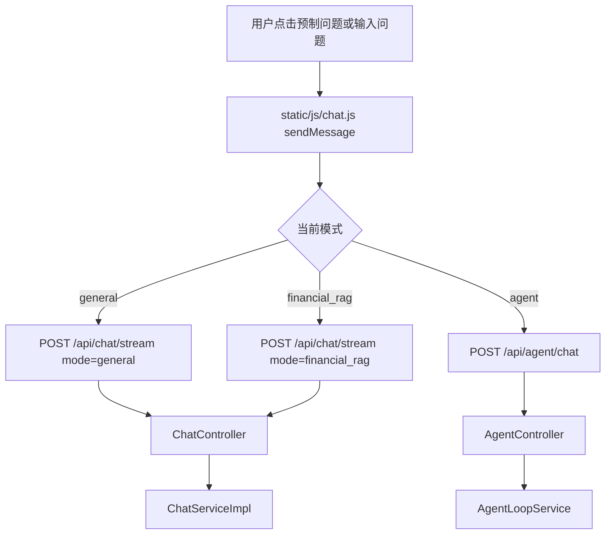
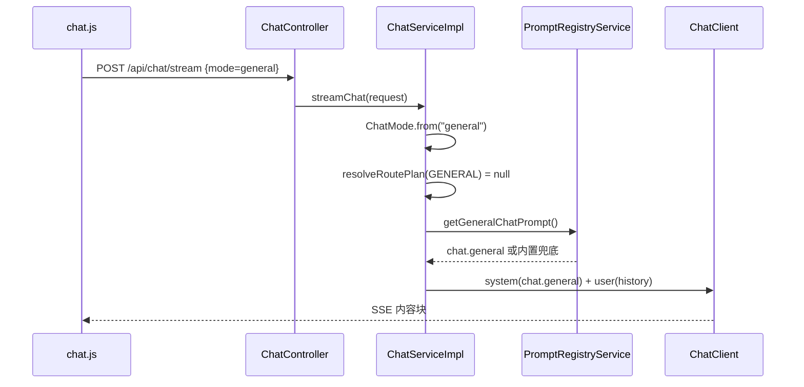
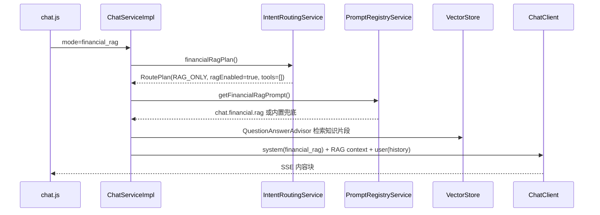
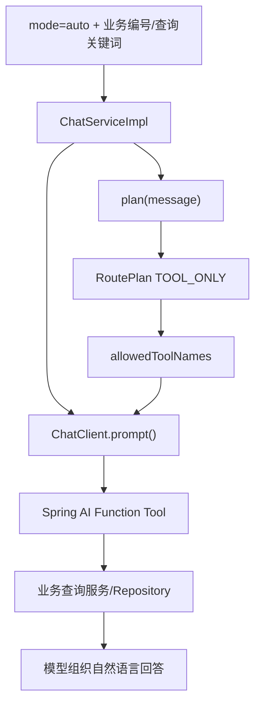
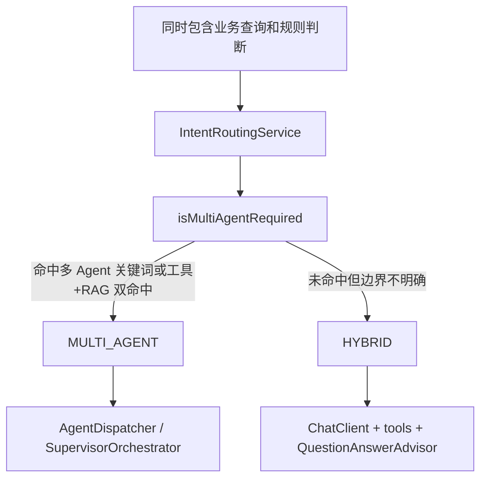
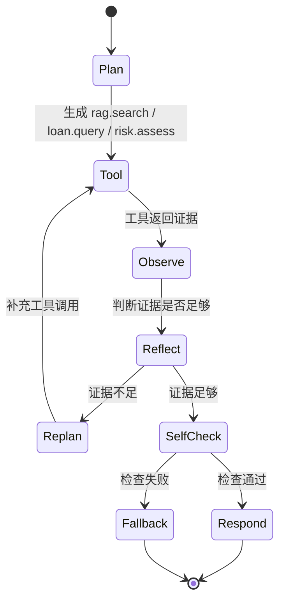
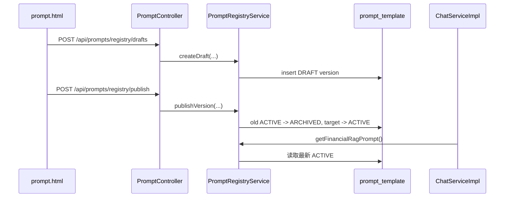
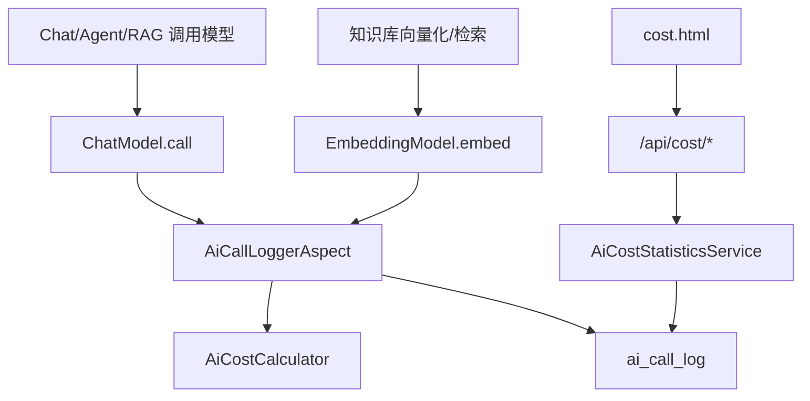

# 11 - Case 链路执行说明：从问题到代码

本文档按具体用户问题拆解执行链路，帮助把页面体验、接口请求、后端代码和底层能力串起来。建议先阅读 [architecture](architecture.md)，再用本文档对照代码走读。

## 1. 总体分流入口

聊天页的第一层分流在前端完成：



关键代码入口：

| 层级 | 文件 | 关注方法 |
|---|---|---|
| 前端模式分流 | `src/main/resources/static/js/chat.js` | `sendMessage()`、`sendAgentMessage()`、`sendStreamMessage()` |
| Chat 请求 DTO | `src/main/java/com/example/aidevelop/model/dto/chat/ChatRequest.java` | `mode` 字段 |
| Chat 模式解析 | `src/main/java/com/example/aidevelop/model/dto/chat/ChatMode.java` | `from()` |
| Chat 编排 | `src/main/java/com/example/aidevelop/service/impl/ChatServiceImpl.java` | `streamChat()`、`resolveRoutePlan()`、`preparePromptSpec()`、`resolveSystemPrompt()` |
| Agent 编排 | `src/main/java/com/example/aidevelop/agent/service/AgentLoopService.java` | `chat()` |

## 2. Case A：常规聊天

示例问题：

> 什么是 RAG？和 Agent 有什么区别？

适用模式：

| 项 | 值 |
|---|---|
| 前端模式 | 常规聊天 |
| 请求接口 | `/api/chat/stream` |
| `ChatRequest.mode` | `general` |
| Prompt key | `chat.general` |
| 是否启用 RAG | 否 |
| 是否开放工具 | 否 |

执行链路：



代码走读重点：

- `ChatMode.from()`：`null`、空值或未知值都会回到 `GENERAL`，这是为了避免误触发金融 RAG 或工具能力。
- `ChatServiceImpl.resolveRoutePlan()`：`GENERAL` 返回 `null`，表示本轮请求不走 `IntentRoutingService`。
- `ChatServiceImpl.preparePromptSpec()`：`routePlan == null` 时只设置 system prompt，不挂载 `QuestionAnswerAdvisor` 和工具。
- `PromptRegistryService.getGeneralChatPrompt()`：读取 `chat.general`，没有数据库版本时使用内置中立助手提示词。

理解要点：

常规聊天不是“金融助贷助手的普通回答”，而是完全独立的通用助手链路。这个设计解决了普通模式仍提示金融助贷身份的问题。

## 3. Case B：金融 RAG 问答

示例问题：

> 请根据金融助贷知识库说明借款申请通常需要关注哪些规则

适用模式：

| 项 | 值 |
|---|---|
| 前端模式 | 金融 RAG |
| 请求接口 | `/api/chat/stream` |
| `ChatRequest.mode` | `financial_rag` |
| Prompt key | `chat.financial.rag` |
| 是否启用 RAG | 是 |
| 是否开放工具 | 否 |

执行链路：



代码走读重点：

- `ChatServiceImpl.resolveRoutePlan()`：`FINANCIAL_RAG` 不再看关键词，直接调用 `intentRoutingService.financialRagPlan()`。
- `IntentRoutingService.financialRagPlan()`：固定返回 `RAG_ONLY`，不开放业务工具。
- `ChatServiceImpl.preparePromptSpec()`：看到 `routePlan.ragEnabled()` 后创建 `QuestionAnswerAdvisor`，并使用 `routePlan.ragTopK()`、`routePlan.ragSimilarityThreshold()`。
- `PromptRegistryService.getFinancialRagPrompt()`：要求模型基于知识库证据回答，证据不足时明确说明。

理解要点：

金融 RAG 只回答“规则、政策、流程、知识库事实”。如果问题涉及具体用户、借款记录或风险评估，应切换到 Agent 任务。

## 4. Case C：自动路由中的业务工具查询

示例问题：

> 查询 LN001 的借款信息

适用模式：

| 项 | 值 |
|---|---|
| 前端模式 | 自动路由或后端直接调用 |
| 请求接口 | `/api/chat` 或 `/api/chat/stream` |
| `ChatRequest.mode` | `auto` |
| Prompt key | `system.default` |
| 路由类型 | `TOOL_ONLY` |
| 是否启用 RAG | 否 |
| 是否开放工具 | 是 |

执行链路：



代码走读重点：

- `IntentRoutingService.plan()`：先匹配业务编号正则和业务查询关键词，命中后返回 `TOOL_ONLY`。
- `IntentRoutingService.resolveAllowedToolNames()`：取“路由希望开放的工具”和“配置实际启用工具”的交集。
- `ChatServiceImpl.preparePromptSpec()`：通过 `promptSpec.toolNames(...)` 只开放本轮允许的工具。

理解要点：

工具查询类问题需要真实业务数据，因此不能只靠 LLM 自己回答。工具列表必须由路由计划控制，不能把所有工具无条件暴露给所有问题。

## 5. Case D：自动路由中的混合问题

示例问题：

> 这笔借款逾期后应该怎么处理？请结合用户还款情况和知识库规则说明

适用模式：

| 项 | 值 |
|---|---|
| 前端模式 | 自动路由或 Agent 任务 |
| `ChatRequest.mode` | `auto` |
| 路由类型 | `HYBRID` 或 `MULTI_AGENT` |
| 是否启用 RAG | 是 |
| 是否开放工具 | 是 |

执行链路：



代码走读重点：

- `IntentRoutingService.isMultiAgentRequired()`：同时命中工具关键词和 RAG 关键词时，会认为可能需要跨能力协作。
- `IntentRoutingService.buildHybridPlan()`：默认兜底为工具 + RAG，适合自动路由下边界不明确的问题。
- `ChatServiceImpl.preparePromptSpec()`：同一个 `RoutePlan` 可以同时挂载工具和 `QuestionAnswerAdvisor`。

理解要点：

混合问题的核心不是“模型更聪明”，而是把结构化业务数据和知识库规则同时放进模型上下文，让模型基于证据组织答案。

## 6. Case E：Agent 借款/还款查询

示例问题：

> 请查询 USER001 的借款记录，并总结当前借款状态

适用模式：

| 项 | 值 |
|---|---|
| 前端模式 | Agent 任务 |
| 请求接口 | `/api/agent/chat` |
| 核心服务 | `AgentLoopService` |
| 典型工具 | `loan.query`、`repayment.query` |
| 返回特点 | `traceId` + `steps` + `finalAnswer` |

执行链路：

```mermaid
sequenceDiagram
  participant UI as chat.js
  participant Controller as AgentController
  participant Loop as AgentLoopService
  participant Planner as AgentPlanner
  participant Executor as AgentToolExecutor
  participant Router as ToolRouter
  participant Responder as AgentResponder

  UI->>Controller: POST /api/agent/chat
  Controller->>Loop: chat(request)
  Loop->>Planner: buildPlan(request, routePlan, allowedTools)
  Planner-->>Loop: toolCalls=[loan.query]
  Loop->>Executor: executeWithRetry(toolCall)
  Executor->>Router: execute("loan.query", args)
  Router-->>Executor: 工具结果
  Executor-->>Loop: observation
  Loop->>Responder: buildFinalAnswer(observations)
  Responder-->>Loop: finalAnswer
  Loop-->>UI: traceId, steps, finalAnswer
```

代码走读重点：

- `chat.js.sendAgentMessage()`：Agent 模式不走 `/api/chat/stream`，而是走 `/api/agent/chat`。
- `AgentLoopService.chat()`：生成 `traceId`，构造 `AgentState`，并记录每个 `AgentStep`。
- `AgentPlanner.buildPlan()`：先让模型生成结构化工具调用计划。
- `AgentToolExecutor.executeWithRetry()`：负责执行工具并重试。
- `ToolRouter.execute()`：根据工具名找到具体 `AgentTool`，并做全局白名单校验。

理解要点：

Agent 和 Chat 最大区别在于：Agent 会显式产出步骤，工具执行结果会被记录为 observation，最终答案来自这些 observation，而不是模型直接猜。

## 7. Case F：Agent 风险评估 + 规则结合

示例问题：

> 请检索知识库中的风控规则，并结合 USER001 的情况给出判断

适用模式：

| 项 | 值 |
|---|---|
| 前端模式 | Agent 任务 |
| 请求接口 | `/api/agent/chat` |
| 典型工具 | `rag.search`、`loan.query`、`repayment.query`、`risk.assess` |
| 关键阶段 | Plan、Tool、Reflect、Replan、SelfCheck、Respond |

执行链路：



代码走读重点：

- `AgentLoopService.chat()`：主流程集中在一个方法里，便于按步骤调试。
- `AgentPolicyEnforcer.resolveAllowedTools()`：决定本轮 Agent 实际可用工具。
- `AgentReflector.reflect()`：判断 observation 是否足够，决定是否提前停止。
- `AgentPlanner.buildReplan()`：在证据不足时继续规划补充工具。
- `AgentResponder.selfCheck()`：最终回答前做自检，失败时 `buildFallbackAnswer()`。

理解要点：

这类问题需要同时有“用户业务数据”和“知识库规则”。如果只用金融 RAG，会缺用户数据；如果只用工具查询，会缺规则依据；Agent Loop 的价值就在于显式编排这些能力。

## 8. Case G：Prompt 发布后影响聊天表现

示例操作：

> 在 Prompt 管理页修改并发布 `chat.financial.rag`

执行链路：



代码走读重点：

- `PromptRegistryService.createDraft()`：同一个 `promptKey + env` 下版本号递增。
- `PromptRegistryService.activateVersion()`：发布或回滚时，把旧 ACTIVE 改为 ARCHIVED，把目标版本改为 ACTIVE。
- `ChatServiceImpl.resolveSystemPrompt()`：每次请求都从 `PromptRegistryService` 取 prompt，因此发布后无需重启即可影响后续请求。

理解要点：

Prompt Registry 是运行时配置治理能力，不是静态文案管理。它直接影响不同模式下模型看到的 system prompt。

## 9. Case H：成本统计链路

示例操作：

> 在聊天页发起一次常规聊天或金融 RAG 问答，然后打开成本看板

执行链路：



代码走读重点：

- `AiCallLoggerAspect`：通过 AOP 记录 ChatModel 和 EmbeddingModel 调用。
- `AiCostCalculator`：按模型定价表估算调用成本。
- `AiCostStatisticsService`：按今日、本周、本月和自定义时间范围聚合。
- `static/js/cost.js`：请求成本接口并渲染图表。

理解要点：

成本观测是横切能力。业务代码不需要每次手动记录成本，只要模型调用经过 Spring Bean，就会被 AOP 切面捕获。

## 10. 调试建议

按 case 走读时可以这样看：

1. 先在 `chat.js` 看前端选择了哪个 mode、打到了哪个接口。
2. 再看 Controller 是否只是透传请求。
3. 然后看核心 Service：Chat 看 `ChatServiceImpl`，Agent 看 `AgentLoopService`，Prompt 看 `PromptRegistryService`。
4. 最后看底层能力：RAG 看 `QuestionAnswerAdvisor` 和 `VectorStore`，工具看 `ToolRouter` 和具体 `AgentTool`，成本看 `AiCallLoggerAspect`。

推荐断点位置：

| Case | 推荐断点 |
|---|---|
| 常规聊天 | `ChatServiceImpl.resolveRoutePlan()`、`resolveSystemPrompt()` |
| 金融 RAG | `IntentRoutingService.financialRagPlan()`、`ChatServiceImpl.preparePromptSpec()` |
| 自动工具 | `IntentRoutingService.plan()`、`ChatServiceImpl.preparePromptSpec()` |
| Agent 查询 | `AgentLoopService.chat()`、`ToolRouter.execute()` |
| Prompt 发布 | `PromptRegistryService.activateVersion()` |
| 成本统计 | `AiCallLoggerAspect`、`AiCostStatisticsService` |
