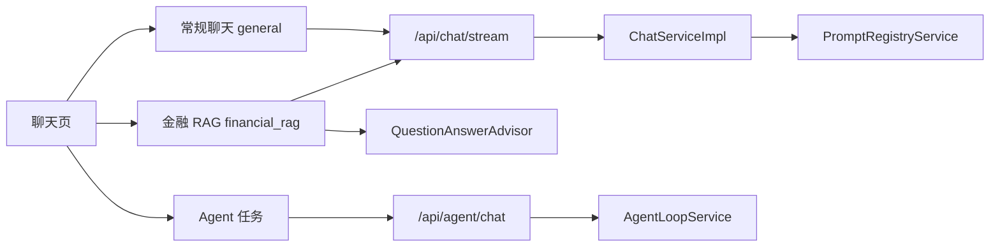

# AI Agent 开发学习文档

基于 Spring Boot 3.3 + Spring AI 的 AI Agent 开发实战教程。以金融贷款助手为业务场景，按难度递进覆盖常规聊天、金融 RAG、Prompt 管理、Function Calling、Agent Loop 和成本观测。

## 架构总览

```
┌─────────────────────────────────────────────────────┐
│                   表现层 (Controller)                 │
│ Chat API / Agent API / RAG API / Prompt API / Cost  │
├─────────────────────────────────────────────────────┤
│                   业务层 (Service)                    │
│ ChatMode Routing │ RagPipeline │ AgentLoop │ PromptOps│
├─────────────────────────────────────────────────────┤
│                Spring AI 抽象层                       │
│   ChatModel │ VectorStore │ Advisor                │
├─────────────────────────────────────────────────────┤
│                   模型提供方                          │
│      DeepSeek(OpenAI) │ OpenAI-Compatible │ Ollama │
└─────────────────────────────────────────────────────┘
```

## 推荐阅读顺序

如果是第一次阅读，建议按“先全局、再主链路、最后专题深入”的顺序：

1. **先读架构总览**：[00 architecture](architecture.md)，建立整体地图，理解前端入口、Chat 模式路由、Prompt Registry、RAG、Agent 和成本观测之间的关系。
2. **再看 case 链路**：[11 case-execution-flows](11-case-execution-flows.md)，用具体问题把页面、接口、Service、Prompt/RAG/Agent/成本代码串起来。
3. **跑通项目**：[01 quick-start](01-quick-start.md)，把环境、配置、启动和页面入口先跑起来。
4. **理解聊天主链路**：[02 chat-basics](02-chat-basics.md) -> [10 chat-memory](10-chat-memory.md)，重点看 `ChatMode`、SSE 流式响应和会话持久化。
5. **理解模型与提示词治理**：[03 multi-llm](03-multi-llm.md) -> [04 prompt-engineering](04-prompt-engineering.md)，重点看模型 Provider 切换和 `chat.general`、`chat.financial.rag`、`system.default` 的边界。
6. **理解工具与 RAG 能力**：[05 function-calling](05-function-calling.md) -> [06 rag-basics](06-rag-basics.md) -> [07 rag-advanced](07-rag-advanced.md) -> [09 embedding-and-chunking](09-embedding-and-chunking.md)。
7. **理解 Agent 与生产化能力**：[design/agent-loop](design/agent-loop.md) -> [08 cost-and-observability](08-cost-and-observability.md)，重点看多步工具编排、trace、调用日志和成本统计。

如果只是为了项目复盘，可以优先阅读 `architecture.md`、`11-case-execution-flows.md`、`02-chat-basics.md`、`04-prompt-engineering.md`、`06-rag-basics.md`、`design/agent-loop.md` 和 `08-cost-and-observability.md`。

## 学习路线

```
第 0 周：建立全局地图
 ┌───────────────────┐
 │ 00 架构总览        │
 │ 模式 + Prompt/RAG  │
 │ Agent + 成本观测   │
 └───────────────────┘

第 1 周：基础入门
 ┌───────────────┐   ┌───────────────┐
 │ 01 快速开始    │ → │ 02 基础对话    │
 │ 架构 + 环境    │   │ 流式 + 历史    │
 └───────────────┘   └───────────────┘

第 2 周：核心技能
 ┌───────────────┐   ┌───────────────┐
 │ 03 多模型接入  │ → │ 04 Prompt 工程 │
 │ Profile 切换   │   │ 模板 + 提示词  │
 └───────────────┘   └───────────────┘

第 3 周：Agent 能力
 ┌───────────────┐   ┌───────────────┐
 │ 05 Function   │ → │ 06 RAG 基础    │
 │ Calling       │   │ 向量 + 知识库  │
 └───────────────┘   └───────────────┘

第 4 周：进阶优化
 ┌───────────────┐   ┌───────────────────┐
 │ 07 RAG 进阶   │ → │ 08 成本与可观测性  │
 │ 混合 + 管道   │   │ AOP + 缓存        │
 └───────────────┘   └───────────────────┘

第 5 周：深入理解
 ┌───────────────────┐
 │ 09 Embedding 与   │
 │ 文本分块策略       │
 └───────────────────┘

第 6 周：会话工程
 ┌───────────────────┐
 │ 10 Chat Memory    │
 │ 持久化 + 流式续聊   │
 └───────────────────┘
```

## 文档索引

| # | 文档 | 主题 | 难度 |
|---|------|------|------|
| 00 | [architecture](architecture.md) | 全局架构、Chat 模式路由、Prompt/RAG/Agent/成本图解 | ★ |
| 01 | [quick-start](01-quick-start.md) | 项目架构、技术栈、环境搭建 | ★ |
| 02 | [chat-basics](02-chat-basics.md) | ChatModel/ChatClient、SSE 流式、对话历史 | ★ |
| 03 | [multi-llm](03-multi-llm.md) | 多模型接入、Provider 抽象、Profile 切换 | ★★ |
| 04 | [prompt-engineering](04-prompt-engineering.md) | Prompt 模板、系统提示词、版本发布 | ★★ |
| 05 | [function-calling](05-function-calling.md) | AI 函数调用、工具注册与执行 | ★★★ |
| 06 | [rag-basics](06-rag-basics.md) | RAG 基础、向量嵌入、知识库构建 | ★★★ |
| 07 | [rag-advanced](07-rag-advanced.md) | 查询重写、混合检索(BM25+向量)、重排序 | ★★★ |
| 08 | [cost-and-observability](08-cost-and-observability.md) | AOP 调用日志、成本计算、Caffeine 缓存 | ★★ |
| 09 | [embedding-and-chunking](09-embedding-and-chunking.md) | 文本分块策略、Ollama 本地嵌入 | ★★★ |
| 10 | [chat-memory](10-chat-memory.md) | 会话持久化、SSE meta 事件、流式续聊 | ★★★ |
| 11 | [case-execution-flows](11-case-execution-flows.md) | 常规聊天、金融 RAG、Agent、Prompt、成本等 case 链路执行说明 | ★★ |

## 设计文档（持续落地）

| 文档 | 内容 |
|------|------|
| [agent-loop](design/agent-loop.md) | Agent Loop 架构（L3 已落地：Plan/Tool/Reflect/Replan/SelfCheck/Respond，风险问题要求 RAG 证据） |
| [enterprise-ai-evolution-todo](design/enterprise-ai-evolution-todo.md) | 企业级 AI 系统演进 TODO（Embedding 升级暂缓） |

## 当前实现边界

- `/api/chat` — 主对话接口，支持 `general`、`financial_rag`、`auto` 三种模式
- `/api/rag` — 高级 RAG 实验（混合检索、重排、评估）
- `/api/agent/chat` — Agent Loop MVP（Plan -> Tool -> Respond，含 traceId 与步骤追踪）
- `/api/prompts/registry` — Prompt Registry（草稿、发布、回滚、版本列表）
- `/api/cost` — 大模型调用成本统计与趋势分析
- 对话历史 — 基于 MySQL `chat_message` 表持久化，重启后可恢复

## 模式边界



更完整的分层图、路由图、Prompt Registry 图、RAG 图和 Agent 时序图见 [整体架构与能力模式](architecture.md)。
