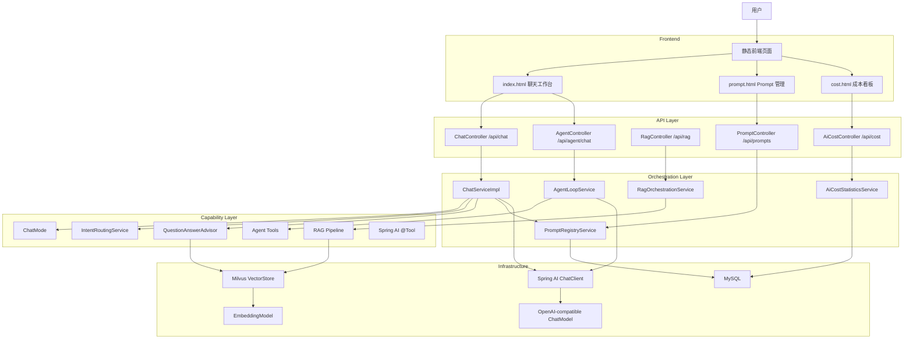
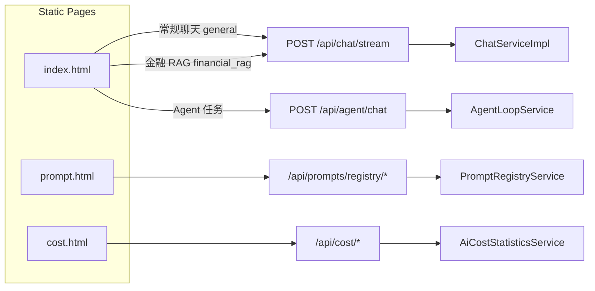
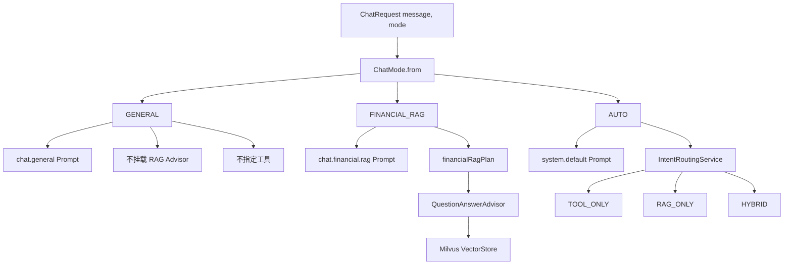
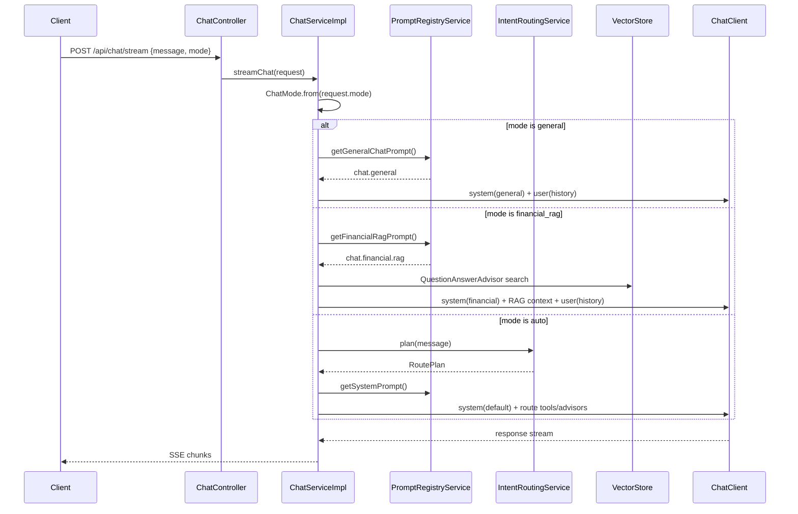
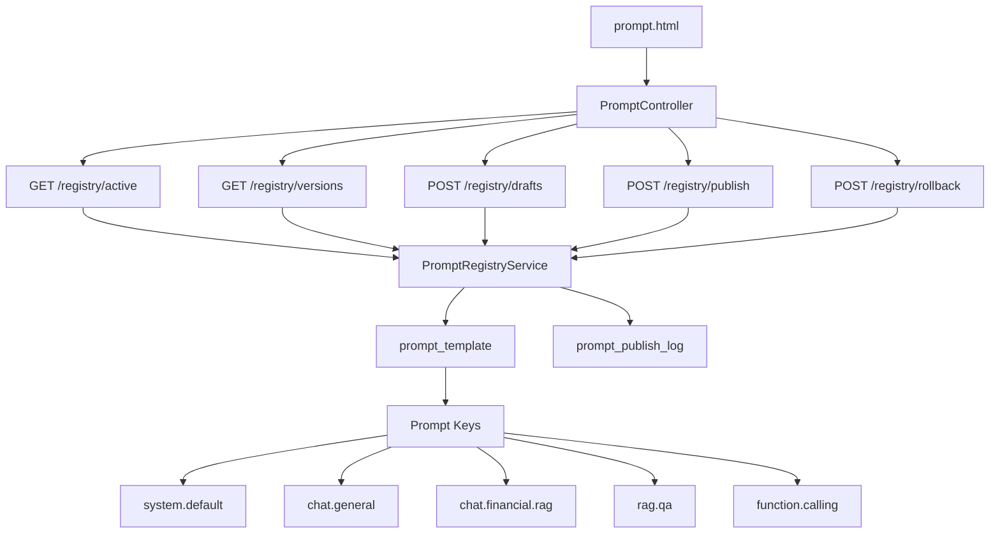
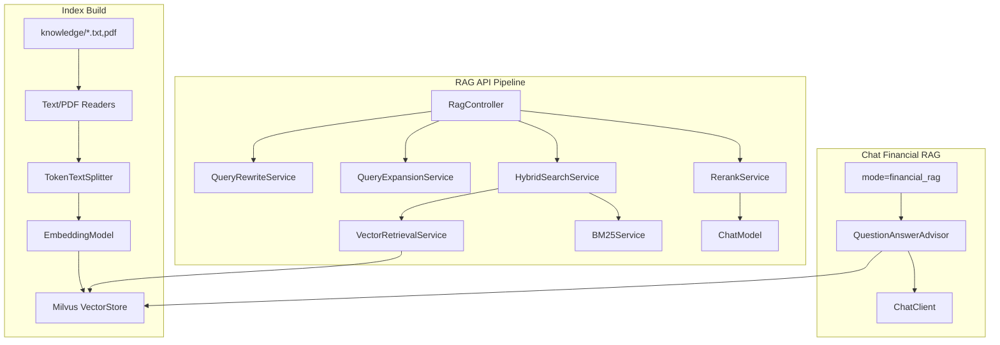
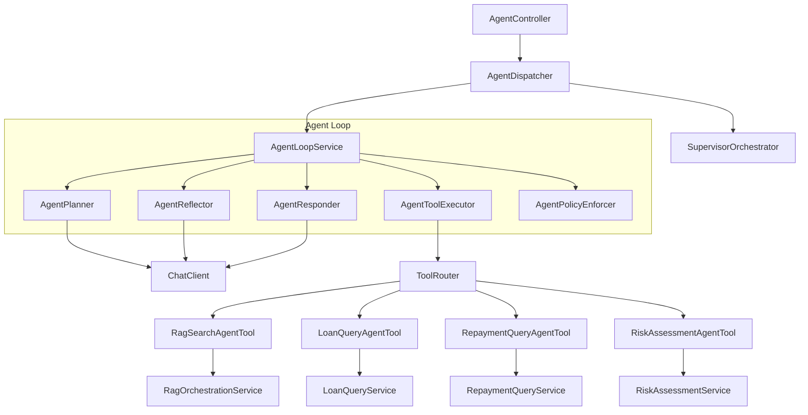
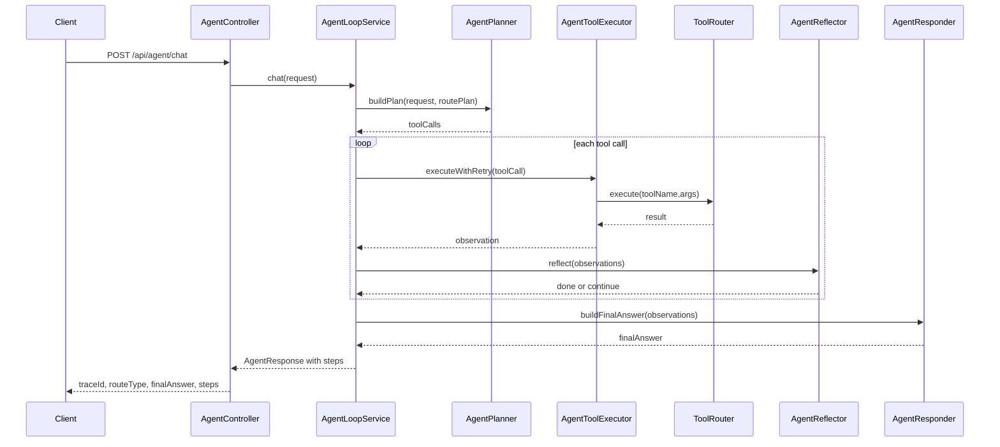
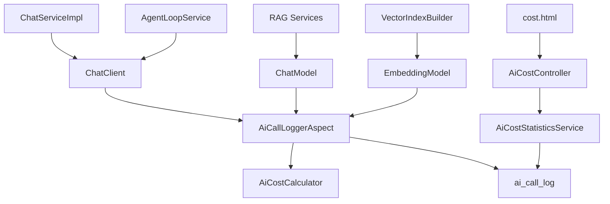
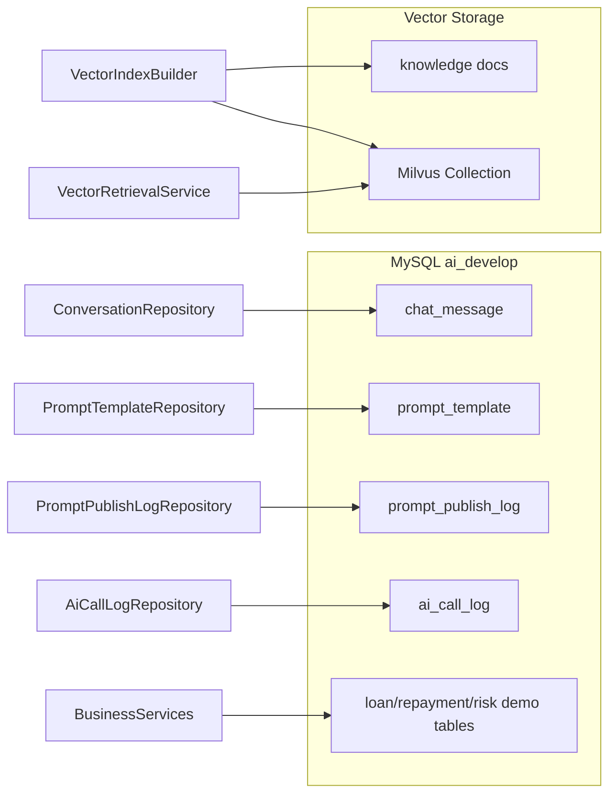

# AI 应用架构说明

本文档用于梳理项目的核心架构，重点服务于学习复盘、方案评审和面试讲解。当前项目已经从“单一金融助贷聊天助手”演进为一个显式支持 **常规聊天、金融 RAG、Agent 任务、Prompt 管理和成本观测** 的 Spring AI 应用。

## 1. 项目定位

本项目是一个基于 Spring Boot 3.3 + Spring AI 1.1 的 AI 应用开发练习项目。它以金融助贷为主要业务场景，但现在不会把所有问题都强行套到金融领域，而是通过前端能力模式和后端 `ChatMode` 显式区分：

- **常规聊天**：通用知识、技术解释、写作润色、方案设计，不启用金融 RAG 和业务工具。
- **金融 RAG**：借款规则、还款规则、风控政策、产品流程等知识库问答，启用 `QuestionAnswerAdvisor`。
- **Agent 任务**：借款查询、还款查询、风险评估、规则结合用户判断，走 `/api/agent/chat` 和显式 Agent Loop。

## 2. 全局系统视图

## 3. 前端页面与能力模式

前端仍是 Spring Boot `static/` 下的原生 HTML/CSS/JS，没有引入 SPA 框架。页面之间通过普通链接跳转。

### 前端模式语义

| UI 模式 | 请求目标 | 请求字段 | 后端行为 |
|---|---|---|---|
| 常规聊天 | `/api/chat/stream` | `mode=general` | 通用 system prompt，不挂 RAG，不启用工具 |
| 金融 RAG | `/api/chat/stream` | `mode=financial_rag` | 金融 RAG system prompt + `QuestionAnswerAdvisor` |
| Agent 任务 | `/api/agent/chat` | AgentRequest | Agent Loop，显式规划和工具执行 |

预制问题也带有 `data-mode`：

- `常规`：解释概念、生成产品说明、写作润色。
- `RAG`：金融助贷规则、政策、流程、逾期原则。
- `Agent`：`CUST1001` 的借款、还款、风险评估和规则结合用户判断。

## 4. Chat 模式路由

`ChatRequest` 新增 `mode` 字段，解析为 `ChatMode`。这一步是区分“常规聊天”和“金融 RAG”的关键，避免普通问题仍被金融助贷系统提示词约束。

### ChatServiceImpl 请求时序

## 5. Prompt 管理架构

Prompt Registry 负责提示词版本治理。它把提示词从代码中剥离出来，支持草稿、发布、回滚和按环境读取。

### Prompt 生效范围

| promptKey | 当前用途 |
|---|---|
| `chat.general` | 常规聊天的中立 system prompt |
| `chat.financial.rag` | 金融 RAG 的领域 system prompt |
| `system.default` | 旧自动路由和兼容链路使用 |
| `rag.qa` | RAG QA 模板管理与实验 |
| `function.calling` | Function Calling 提示词管理与实验 |

`PromptRegistryService` 对 `chat.general` 和 `chat.financial.rag` 提供内置兜底：如果本地数据库尚未执行新 SQL，运行时不会直接失败；执行 `sql/prompt_registry.sql` 后，优先读取数据库中的 ACTIVE 版本。

## 6. RAG 架构

RAG 有两条使用路径：

- Chat 页面中的“金融 RAG”模式：走 `QuestionAnswerAdvisor`，适合直接面向用户问答。
- `/api/rag/*` 调试接口：走显式 RAG pipeline，适合调试检索、混合检索、重排和评估。

## 7. Agent 任务架构

Agent 任务用于“需要查真实业务数据或执行多步工具链”的问题。它不依赖 Chat 模式路由，而是独立入口 `/api/agent/chat`。

### Agent 时序

## 8. 成本与观测架构

成本统计不是业务主链路的一部分，而是横切关注点。`AiCallLoggerAspect` 拦截模型调用，记录模型名、Token、耗时、成功失败和成本。

## 9. 数据存储视图

## 10. 面试表达建议

可以把项目概括为：

> 这是一个面向 AI 应用开发学习和面试准备的综合实践项目。它以金融助贷为主要业务场景，但通过显式 `ChatMode` 区分常规聊天、金融 RAG 和 Agent 任务，避免所有问题都被同一个金融系统提示词绑定。系统用 Spring AI `ChatClient` 承接模型调用，用 Prompt Registry 治理不同能力模式的 system prompt，用 Milvus 承接知识库检索，用 Agent Loop 编排业务工具，并通过 AOP 记录调用成本和可观测数据。

讲解顺序建议：

1. 从前端三个入口讲清楚用户体验：Chat、Prompt、Cost。
2. 从 `ChatMode` 讲清楚常规聊天和金融 RAG 的边界。
3. 从 Prompt Registry 讲清楚提示词治理和版本发布。
4. 从 RAG 管道讲清楚知识库如何进入模型上下文。
5. 从 Agent Loop 讲清楚工具调用、观察、反思和最终回答。
6. 从成本看板讲清楚大模型应用生产化时的观测和费用控制。
