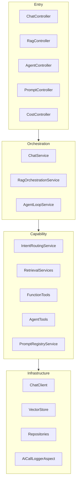
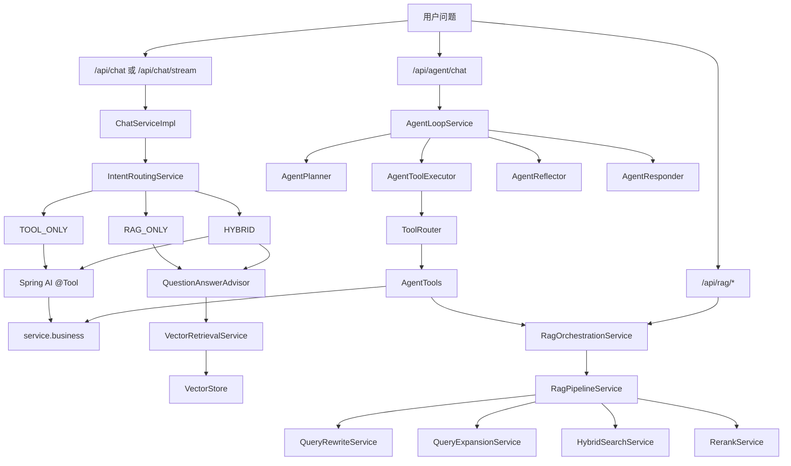
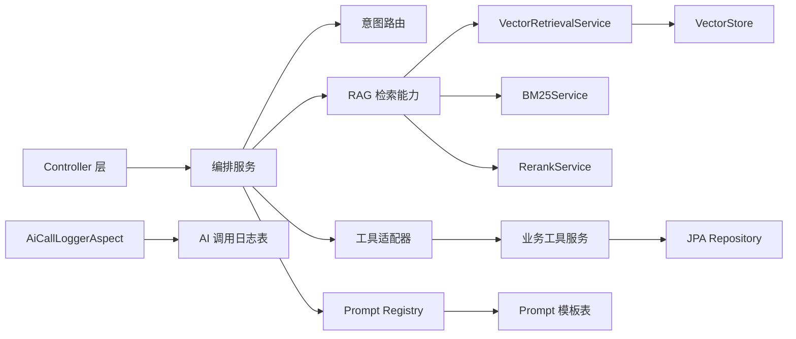
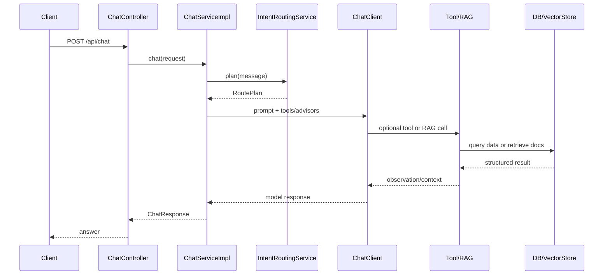
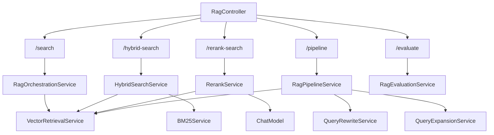
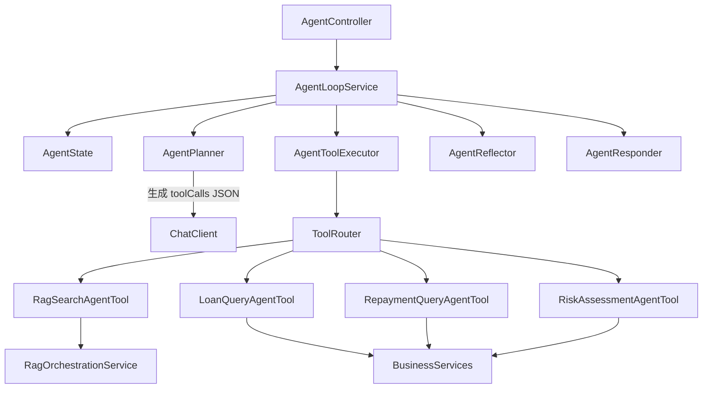

# AI 应用架构说明

本文档用于梳理项目的核心架构，重点服务于学习复盘和面试讲解。

## 项目定位

本项目是一个基于 Spring Boot + Spring AI 的 AI 应用开发练习项目。业务场景模拟金融信贷助手，覆盖普通对话、Function Calling、RAG 检索增强、Agent Loop、Prompt 管理、调用观测和成本统计。

项目的重点不是单纯调用大模型接口，而是练习大模型能力如何和后端业务系统、知识库、工具调用、配置治理结合。

## 分层视图

## 请求路由总览

下面这张图适合从用户问题出发，理解系统如何决定走纯聊天、工具调用、RAG 或 Agent。

## 核心依赖关系

这张图强调“能力复用”的边界：Controller 不直接依赖模型、向量库和数据库，而是通过编排服务与能力服务间接访问。

## 三条 AI 入口

### Chat 入口

`ChatController` 提供普通聊天和 SSE 流式聊天接口，主要用于体验面向用户的对话能力。请求进入 `ChatServiceImpl` 后，会先经过 `IntentRoutingService` 判断问题类型，再按路由结果动态挂载工具或 RAG Advisor。

Chat 入口适合讲解：

- 多轮对话历史如何拼接到 prompt
- 如何通过意图路由区分纯聊天、业务工具和知识问答
- 如何使用 Spring AI 的 `@Tool` / Function Calling
- 如何使用 `QuestionAnswerAdvisor` 接入基础 RAG

### RAG API 入口

`RagController` 暴露知识库检索相关接口，包括基础向量检索、混合检索、重排序、智能 RAG 管道和评估。

RAG API 入口适合讲解：

- 文档加载、切分、向量化和入库
- 查询重写、查询扩展、混合检索和重排序
- 检索效果如何用 Recall、Precision、F1、MRR、NDCG 评估
- RAG 能力如何单独调试和优化

### Agent 入口

`AgentController` 提供显式 Agent Loop 接口。与 Chat 入口依赖 Spring AI 自动工具调用不同，Agent 入口自己控制 Plan、Tool、Reflect、Replan、SelfCheck 和 Respond。

Agent 入口适合讲解：

- Agent 如何先规划再调用工具
- 如何通过 `ToolRouter` 管理工具白名单
- 如何把 RAG、借款查询、还款查询、风险评估包装成 Agent 工具
- 如何用 traceId 和 steps 观察整轮执行过程

## 共享能力

### 意图路由

`IntentRoutingService` 根据业务编号、关键词和配置输出结构化 `RoutePlan`，用于决定请求走 Tool-only、RAG-only 还是 Hybrid 模式。

### RAG 检索

RAG 能力集中在 `service/rag` 包中。当前包含向量检索、BM25、混合检索、重排序、查询重写、查询扩展和评估服务。后续重构目标是进一步收敛向量检索参数构造，减少重复的 `SearchRequest` 代码。

### 工具调用

项目保留两种工具接入方式：

- `service/function`：通过 Spring AI `@Tool` 给 Chat 入口使用
- `agent/tool`：通过 `AgentTool` 和 `ToolRouter` 给 Agent 入口使用

两种方式体现了“框架自动 Function Calling”和“自研显式 Agent Tool”两种实现路径。

### Prompt 管理

`PromptRegistryService` 支持 Prompt 草稿、发布、回滚和按环境读取。它体现 PromptOps 思路：Prompt 不硬编码在业务代码里，而是像配置一样进行版本治理。

### 观测和成本

`AiCallLoggerAspect` 通过 AOP 记录 Chat 和 Embedding 调用，结合 `AiCostStatisticsService` 提供成本统计接口。这个模块用于理解大模型应用生产化时的可观测性和成本控制。

## 面试表达建议

可以把项目概括为：

> 这是一个面向 AI 应用开发学习和面试准备的综合实践项目。它以金融信贷助手为业务场景，把大模型对话、Function Calling、RAG、Agent Loop、PromptOps 和成本观测串成一套可运行的后端系统。项目中 Chat、RAG API 和 Agent 是三种不同编排方式，底层复用路由、检索、工具、Prompt 和数据库能力。

