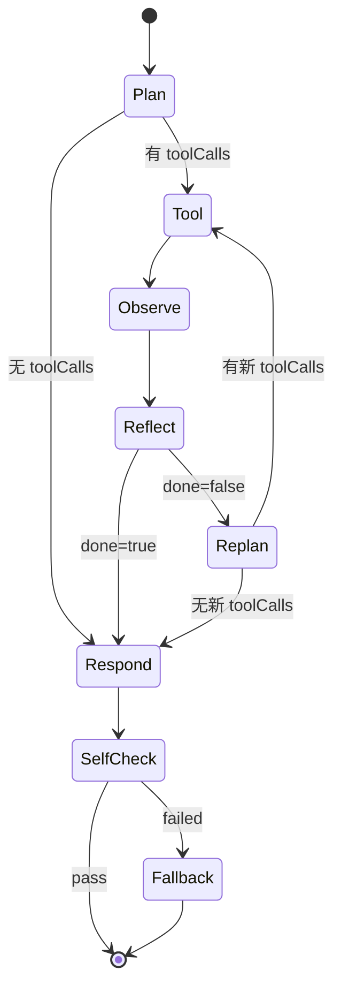

# Agent Loop 架构

本文档说明当前单 Agent Runtime 的设计。Agent Loop 用于处理需要业务工具、知识库证据和多轮判断的任务。

## 1. 设计目标

当前 Agent Runtime 关注五个工程问题：

1. LLM 输出必须结构化校验，不能直接相信模型文本。
2. 每轮执行要有预算控制，避免无限调用。
3. LLM 调用要有超时边界。
4. 每个步骤要有明确状态和失败原因。
5. 执行 trace 要能持久化并和模型调用成本关联。

## 2. 核心流程



## 3. 请求时序

```mermaid
sequenceDiagram
  participant Client
  participant Controller as AgentController
  participant Loop as AgentLoopService
  participant Planner as AgentPlanner
  participant Llm as AgentLlmClient
  participant Validator as AgentStructuredOutputValidator
  participant Tool as AgentToolExecutor
  participant Router as ToolRouter
  participant Reflector as AgentReflector
  participant Responder as AgentResponder
  participant Trace as AgentTraceService

  Client->>Controller: POST /api/agent/chat
  Controller->>Loop: chat(request)
  Loop->>Loop: init traceId, budget, AgentTraceContext
  Loop->>Planner: buildPlan
  Planner->>Llm: call phase=PLAN
  Llm-->>Planner: raw response
  Planner->>Validator: parse JSON
  Validator-->>Planner: AgentPlanResult
  Loop->>Tool: executeWithRetry
  Tool->>Router: execute(toolName,args)
  Router-->>Tool: result
  Tool-->>Loop: observation
  Loop->>Reflector: reflect
  Reflector->>Llm: call phase=REFLECT
  Reflector->>Validator: parse JSON
  Loop->>Responder: buildFinalAnswer
  Responder->>Llm: call phase=RESPOND
  Loop->>Responder: selfCheck
  Responder->>Llm: call phase=SELF_CHECK
  Loop->>Trace: persistTrace
  Loop-->>Controller: AgentResponse
  Controller-->>Client: traceId + steps + finalAnswer
```

## 4. 核心组件

| 组件 | 作用 |
|---|---|
| `AgentLoopService` | 主编排入口 |
| `AgentState` | 保存 steps、observations、预算、运行状态 |
| `AgentPlanner` | 生成初始计划和重规划 |
| `AgentToolExecutor` | 工具调用、超时、重试、TraceContext 透传 |
| `ToolRouter` | 根据工具名路由到具体 `AgentTool` |
| `AgentReflector` | 判断证据是否足够 |
| `AgentResponder` | 生成最终答案和自检 |
| `AgentLlmClient` | 统一 LLM 调用、超时和 trace 上下文 |
| `AgentStructuredOutputValidator` | JSON 提取、解析和结构校验 |
| `AgentBudgetTracker` | 每轮 LLM/tool 调用预算 |
| `AgentTraceService` | 持久化 trace 和 step |

## 5. 结构化输出校验

Planner、Reflector、Responder 和 Supervisor 不再各自散落解析 JSON，而是通过 `AgentStructuredOutputValidator` 统一处理。

模型输出会经过：

1. 提取 JSON 片段。
2. Jackson 反序列化。
3. 必要字段校验。
4. 异常分类为 `AgentStructuredOutputException`。

这能减少“模型多说一句话导致 JSON 解析失败”的不确定性，并把失败原因明确写入 step。

## 6. 预算与超时

`AgentBudgetTracker` 记录：

- 当前 round
- LLM 调用次数
- 工具调用次数
- token 预算预留字段
- request 级别预算摘要

`AgentLlmClient` 使用 `CompletableFuture.orTimeout(...)` 控制单次 LLM 调用超时。超时会被分类为 `AgentLlmTimeoutException`，最终映射到 `AgentFailureReason.LLM_TIMEOUT`。

## 7. Step 状态与失败原因

每个 `AgentStep` 都包含：

- `actionType`
- `toolName`
- `toolInput`
- `toolOutput`
- `success`
- `status`
- `failureReason`
- `roundIndex`

`status` 使用 `AgentStepStatus`，`failureReason` 使用 `AgentFailureReason`。这让前端和 trace 查询能够清晰区分：

- 工具失败
- LLM 超时
- 预算超限
- 结构化输出解析失败
- 自检失败
- 降级成功

## 8. Trace 持久化

Agent 执行结束后，`AgentTraceService.persistTrace(...)` 会以 best-effort 方式保存：

```text
agent_trace
agent_step
```

即使 trace 保存失败，也不会覆盖主业务响应。

查询接口：

```text
GET /api/agent/trace/{traceId}
```

## 9. RAG 工具

Agent 的 `rag.search` 工具通过统一 RAG Facade 获取证据：

```text
ToolRouter
  -> RagSearchAgentTool
  -> RagFacade.retrieve(RagProfile.AGENT)
  -> RagRetrievalResult
```

因此 Agent 和 Chat 使用同一套 RAG Pipeline，避免知识库问答行为不一致。

## 10. 当前评价

当前 Agent Runtime 已经具备面试中值得重点讲的工程化特征：

- 可控：预算、超时、最大步数、工具白名单。
- 可观测：step 状态、失败原因、traceId、callPhase。
- 可复用：Planner/Reflector/Responder 被单 Agent 和多 Agent 复用。
- 可扩展：新增工具只需要实现 `AgentTool` 并注册到 `ToolRouter`。
