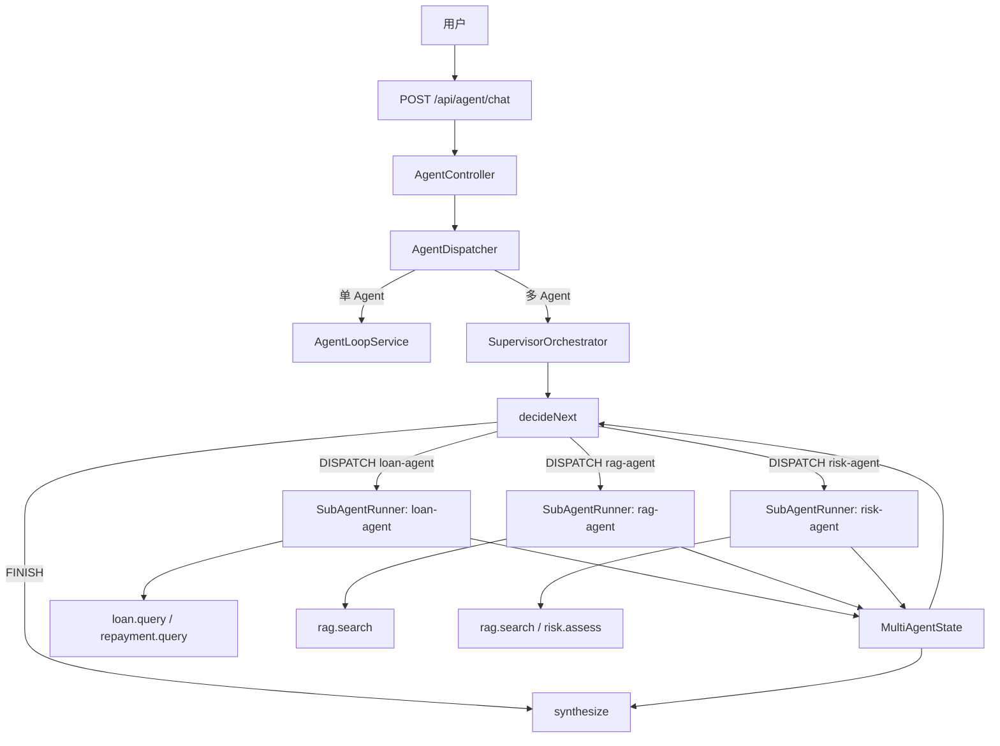
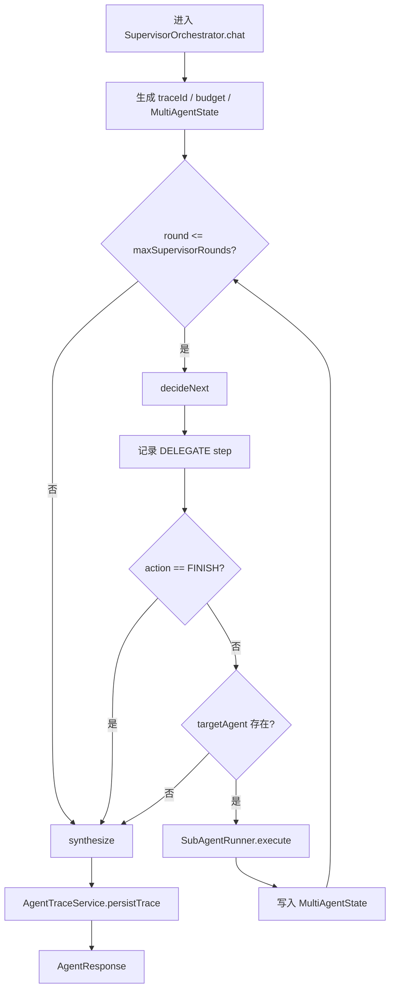
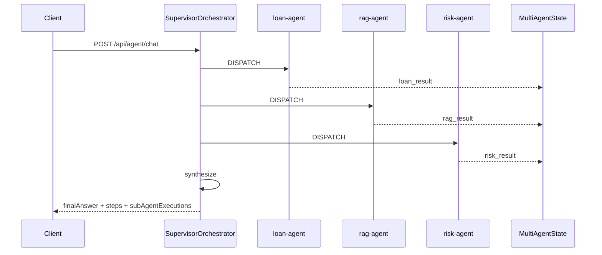

# 多 Agent 架构

本文档说明项目中的多 Agent Supervisor 设计。多 Agent 用于处理跨领域任务，例如同时需要借款数据、还款数据、知识库规则和风险判断的复杂问题。

## 1. 设计目标

多 Agent 不是为了“多调用几个模型”，而是为了解决三类工程问题：

1. **职责分离**：不同 Agent 处理不同专业域。
2. **工具隔离**：每个 Agent 只拿到自己的 `allowedTools`。
3. **过程可观测**：Supervisor 决策、子 Agent 输出、工具步骤都进入统一 trace。

## 2. 总体架构



## 3. 入口分流

`AgentController` 注入的是 `AgentService`，实际生效实现是 `@Primary` 的 `AgentDispatcher`。

触发多 Agent 的规则：

| 条件 | 行为 |
|---|---|
| `app.chat.multi-agent.enabled=false` | 永远回退单 Agent |
| `AgentRequest.multiAgent=true` | 强制多 Agent |
| `AgentRequest.multiAgent=false` | 强制单 Agent |
| `multiAgent == null` | 由 `IntentRoutingService` 判断是否需要多 Agent |

多 Agent 成本更高、链路更长，所以只用于复杂跨域任务。

## 4. Supervisor 循环

`SupervisorOrchestrator` 每轮让 LLM 输出一个结构化决策：

```json
{"action":"DISPATCH","targetAgent":"loan-agent","reason":"先查询用户借款和还款数据"}
```

或：

```json
{"action":"FINISH","reason":"已有结果足够生成综合回答"}
```

流程：



Supervisor 只负责调度和综合，不直接调用业务工具。

## 5. 子 Agent

当前配置的子 Agent：

| Agent | 职责 | 可调用工具 | 输出 |
|---|---|---|---|
| `loan-agent` | 查询借款和还款事实数据 | `loan.query`, `repayment.query` | `loan_result` |
| `rag-agent` | 检索金融规则和政策 | `rag.search` | `rag_result` |
| `risk-agent` | 综合业务数据和规则做风险判断 | `rag.search`, `risk.assess` | `risk_result` |

每个子 Agent 通过 `SubAgentRunner` 复用单 Agent Runtime：

- `AgentPlanner`
- `AgentToolExecutor`
- `AgentReflector`
- `AgentResponder`
- `AgentLlmClient`
- `AgentStructuredOutputValidator`
- `AgentBudgetTracker`

这意味着多 Agent 自动继承单 Agent 的结构化输出校验、超时、预算、失败分类和 trace 能力。

## 6. 共享状态

`MultiAgentState` 是 Supervisor 和子 Agent 之间的共享黑板。

| 字段 | 用途 |
|---|---|
| `sharedData` | 保存 `loan_result`、`rag_result`、`risk_result` |
| `allSteps` | 汇总 Supervisor 和子 Agent 的执行步骤 |
| `executions` | 保存每个子 Agent 响应、耗时和 outputKey |

Supervisor 每轮会读取共享状态，避免重复调度已经完成的 Agent。

## 7. 工具隔离

工具边界有两层：

1. `SubAgentDefinition.allowedTools`：限制某个子 Agent 能看到和规划哪些工具。
2. `ToolRouter.isAllowed()`：全局工具白名单兜底，防止非法工具名被执行。

这个设计让 `loan-agent` 不能直接做风险评估，`rag-agent` 不能访问用户业务数据，`risk-agent` 才负责综合判断。

## 8. Agent-as-Tool

除了 Supervisor 编排，项目还支持轻量的 Agent-as-Tool：

```text
AgentPlanner -> toolCall(agent.delegate) -> SubAgentTool -> SubAgentRunner
```

两种模式区别：

| 模式 | 适用场景 | 调度方式 |
|---|---|---|
| Supervisor | 明确复杂跨域任务 | Supervisor 多轮调度子 Agent |
| Agent-as-Tool | 单 Agent 偶尔需要专家能力 | 子 Agent 像普通工具一样被调用一次 |

## 9. 示例链路

请求：

```json
{
  "message": "查询 CUST1001 的借款和还款情况，再结合知识库规则综合评估风险",
  "multiAgent": true
}
```

可能链路：



## 10. 响应与观测

多 Agent 响应仍然使用 `AgentResponse`，包含：

- `traceId`
- `status`
- `failureReason`
- `budgetSummary`
- `steps`
- `subAgentExecutions`
- `tracePersisted`

面试时可以强调：多 Agent 并没有绕开已有 Runtime，而是复用并扩展它，所以可观测、失败分类和成本追踪是一致的。
