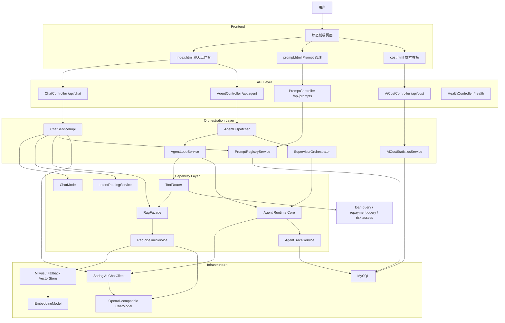
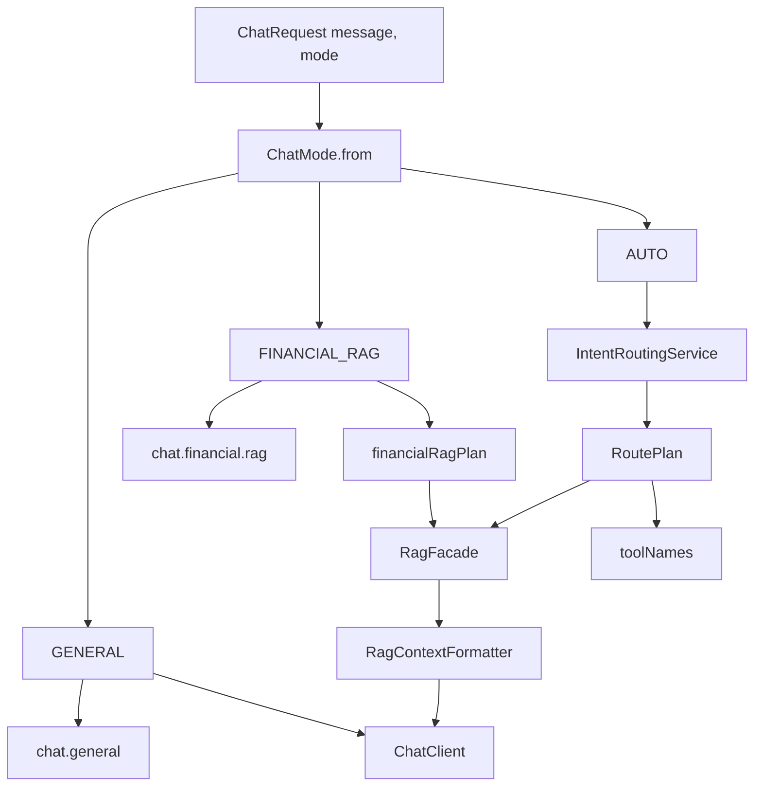
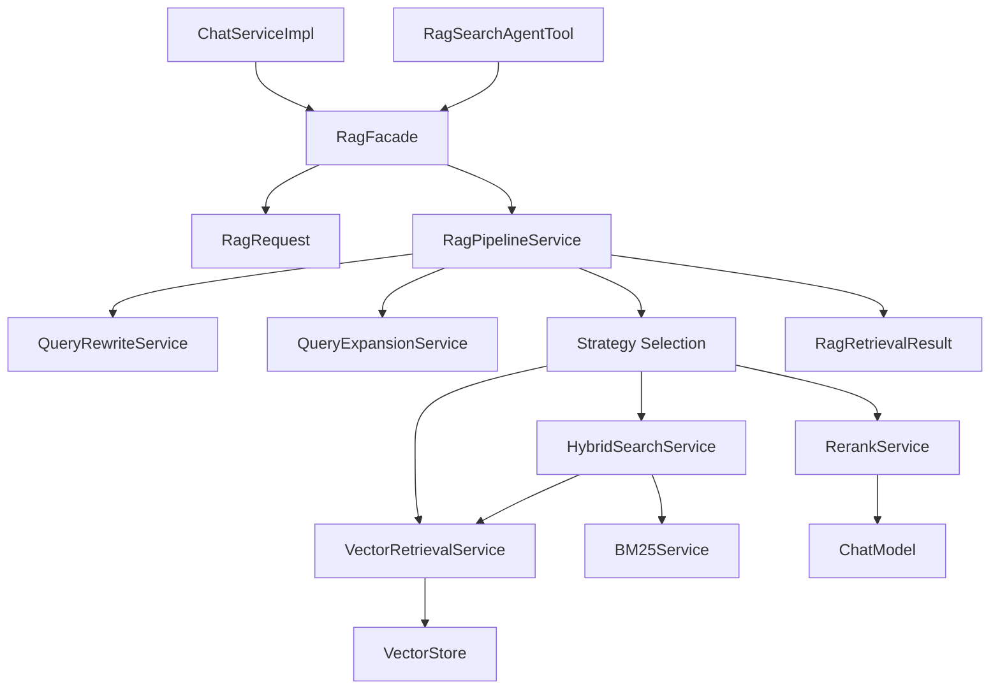
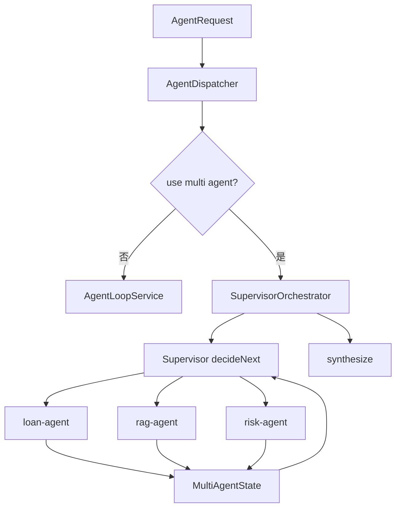

# 项目架构总览

本文档描述当前项目架构。项目已经收敛为一个以金融信贷为业务场景的 AI 应用工程化样板，核心重点是 **Chat、多模式路由、统一 RAG、Agent Runtime、多 Agent、Prompt 治理、成本观测和 Trace 回放**。

## 1. 项目定位

项目基于 Spring Boot 3.3.5 + Spring AI 1.1.6，使用 OpenAI-compatible Chat/Embedding 模型、MySQL、Spring Data JPA 和 Milvus VectorStore。

当前能力分为三条主链路：

| 链路 | 入口 | 说明 |
|---|---|---|
| Chat | `/api/chat`, `/api/chat/stream` | 常规聊天、金融 RAG、自动路由 |
| Agent | `/api/agent/chat` | 单 Agent 或多 Agent 的工具编排任务 |
| Governance | `/api/prompts/*`, `/api/cost/*`, `/api/agent/trace/*` | Prompt 治理、成本观测、Agent Trace |

生产环境不再暴露独立 RAG 调试接口。RAG 被作为内部能力，通过 `RagFacade` 被 Chat 和 Agent 共同复用。

## 2. 总体架构

## 3. Chat 模式

`ChatRequest.mode` 会被解析为 `ChatMode`：

| 模式 | 后端行为 |
|---|---|
| `general` | 常规聊天，不启用 RAG，不暴露业务工具 |
| `financial_rag` | 使用金融 RAG prompt，并通过 `RagFacade` 检索知识库证据 |
| `auto` | 兼容旧自动路由，由 `IntentRoutingService` 判断工具、RAG 或混合链路 |

Chat 链路不再直接挂载一套独立检索链路。如果 `RoutePlan.ragEnabled=true`，`ChatServiceImpl` 会调用 `RagFacade.retrieve(...)`，再由 `RagContextFormatter` 把证据注入 prompt。

## 4. 统一 RAG 架构

`RagFacade` 是 RAG 的生产入口，负责统一 Chat 与 Agent 工具的检索行为。

RAG 结果统一封装为 `RagRetrievalResult`，包含：

- 原始查询、重写查询、扩展查询
- 检索策略
- 文档片段、metadata、score
- empty/degraded 状态
- 降级原因

## 5. Agent Runtime

Agent Runtime 现在由以下组件组成：

| 组件 | 作用 |
|---|---|
| `AgentLoopService` | 单 Agent 主循环 |
| `AgentPlanner` | 生成 toolCalls |
| `AgentToolExecutor` | 工具执行、超时、重试 |
| `AgentReflector` | 判断证据是否足够 |
| `AgentResponder` | 生成最终答案和 SelfCheck |
| `AgentLlmClient` | 统一 LLM 调用、超时、TraceContext |
| `AgentStructuredOutputValidator` | 统一 JSON 提取和结构化校验 |
| `AgentBudgetTracker` | 每轮 LLM 调用预算和工具调用计数 |
| `AgentTraceService` | 持久化 `agent_trace` 和 `agent_step` |

Agent 步骤现在有明确状态和失败分类：

- `AgentStepStatus`：`SUCCEEDED`、`FAILED`、`DEGRADED`、`TIMED_OUT` 等
- `AgentFailureReason`：`PLAN_PARSE_ERROR`、`LLM_TIMEOUT`、`TOOL_TIMEOUT`、`SELF_CHECK_FAILED`、`BUDGET_EXCEEDED` 等

## 6. 多 Agent 架构

`AgentController` 注入的是 `AgentService`，实际入口是 `@Primary` 的 `AgentDispatcher`：

多 Agent 不是默认开启所有复杂链路，而是由三层规则控制：

1. `app.chat.multi-agent.enabled`
2. `AgentRequest.multiAgent`
3. `IntentRoutingService.plan(message)` 是否返回 `MULTI_AGENT`

## 7. 可观测与 Trace

Agent 响应会返回 `traceId`，同时 `AgentTraceService` 会以 best-effort 方式持久化：

- `agent_trace`：一次 Agent 请求的头信息
- `agent_step`：每个 PLAN/TOOL/REFLECT/SELF_CHECK/RESPOND/DELEGATE 步骤

`AiCallLoggerAspect` 会读取 `AgentTraceContext`，将 LLM 调用日志写入 `ai_call_log`，并记录：

- `trace_id`
- `call_phase`
- token
- cost
- latency
- status

这样可以把 Agent 执行步骤和底层模型调用成本关联起来。

## 8. 当前架构评价

当前架构已经形成了比较完整的 AI 应用工程闭环：

- Chat 与 Agent 共享 RAG 能力，不再双轨。
- Agent Runtime 有明确的执行状态、失败原因和预算控制入口。
- Trace 和 cost 可以通过 `traceId` 串起来。
- Prompt、RAG、Tool、Agent、Cost 各模块边界清楚。

后续可继续演进的方向：

- 让 `RagProfile` 真正驱动不同检索策略。
- 将 `AgentBudgetTracker` 从调用次数扩展到 token/cost 预算。
- 补齐 `HYBRID_WITH_RERANK` 的完整重排实现。
