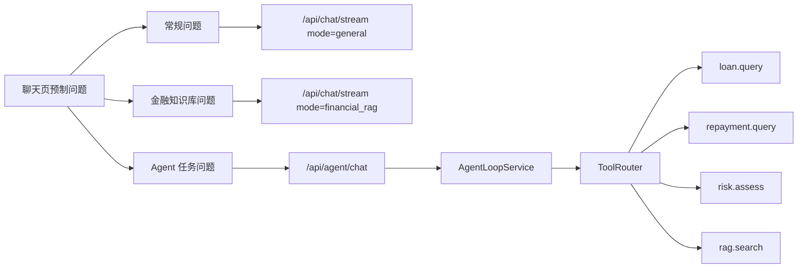
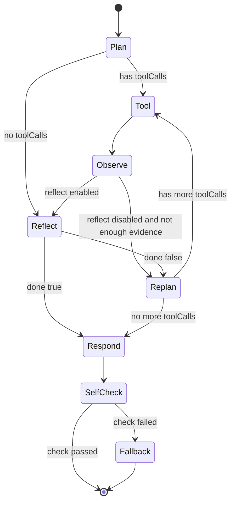
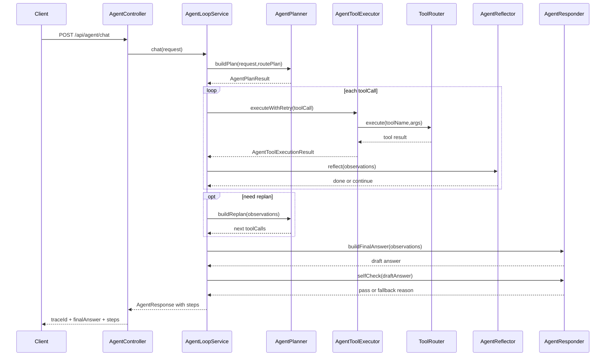
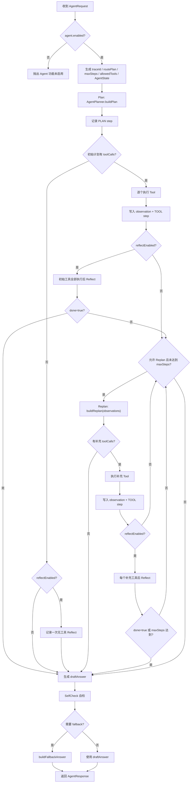
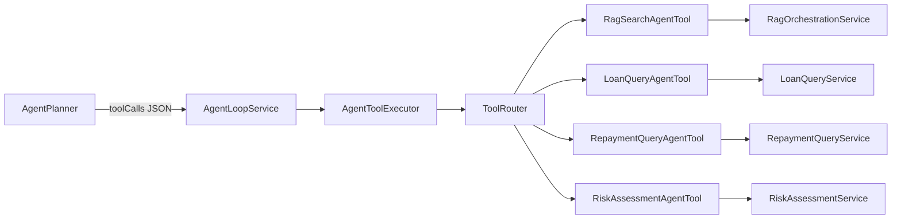

# 从 Chat+RAG 到 Agent Loop 设计文档

## 1. 背景与目标
当前项目已经具备：
- 多模型对话（普通 + 流式）
- Function Calling（贷款/还款/风控）
- RAG（查询重写、扩展、混合检索、重排、评估）
- Prompt Registry（常规聊天、金融 RAG、自动路由等提示词版本治理）

下一阶段目标是将能力升级为可迭代的 Agent Loop：
- 让系统具备“规划 -> 工具调用 -> 观察 -> 反思 -> 输出”的闭环
- 让每一轮执行可观测、可回放、可评估
- 保持与现有 `ChatService` / `RagPipelineService` / Function 模块兼容

当前前端聊天页已经把 Agent 任务与 `general`、`financial_rag` 明确区分。常规聊天和金融 RAG 走 `/api/chat` 或 `/api/chat/stream`；需要查询客户借款、还款、风险评估等多步工具任务时，才走 `/api/agent/chat`。



## 2. Agent Loop 定义

推荐采用最小可用闭环（MVP）：

1) **Plan**：基于用户输入生成执行计划（可只生成 1~3 步）  
2) **Act**：调用工具（RAG 检索、函数调用、系统工具）  
3) **Observe**：收集工具返回结果并结构化  
4) **Reflect**：判断是否继续调用工具、是否已可回答  
5) **Respond**：输出最终答案并附带可选推理摘要  

终止条件：
- 达到最大步数（默认 6 步）
- LLM 给出 `done=true`
- 发生不可恢复错误

### 2.1 执行状态机



### 2.2 当前代码执行时序



### 2.3 `AgentLoopService#chat` 当前实现详解

`AgentLoopService#chat` 是当前 Agent Loop 的核心编排入口。它不直接负责某一个具体工具的业务逻辑，而是负责把“用户问题 -> 路由判断 -> 工具计划 -> 工具执行 -> 证据判断 -> 最终回答”串成一条可追踪的执行链路。

入口位置：

```text
com.example.aidevelop.agent.service.AgentLoopService#chat
```

整体流程可以理解为：



#### 2.3.1 启动与初始化

方法一开始会先检查 `agentProperties.isEnabled()`。如果 Agent 功能未启用，直接抛出 `AiServiceException`，避免未配置完整时误触发工具编排。

通过校验后，初始化四类关键上下文：

- `traceId`：每次 Agent 请求的唯一追踪 ID，最终会返回给前端，也会出现在日志中。
- `routePlan`：由 `IntentRoutingService.plan(request.getMessage())` 生成，判断本次问题是 RAG、工具调用、混合链路还是其它路由。
- `maxSteps`：由请求参数、全局配置和路由计划三者共同收敛，避免 Agent 无限循环或过度调用工具。
- `allowedTools`：由 `AgentPolicyEnforcer.resolveAllowedTools(...)` 得出，表示本轮 Agent 实际允许调用的工具集合。

这些信息会被放入 `AgentState`。`AgentState` 是整轮 loop 的内存态，负责保存：

- `steps`：可返回给前端展示的执行轨迹。
- `observations`：工具执行结果沉淀出的证据文本。
- `executedToolNames`：已经执行过的工具名，用于 Replan 避免重复规划。
- `executedToolCalls`：已执行工具次数，用于控制 `maxSteps`。
- `shouldStop` / `replanFailed`：控制后续是否继续 Replan 或是否进入 fallback。

#### 2.3.2 Plan：先规划，不直接回答

Plan 阶段调用：

```text
AgentPlanner.buildPlan(request, routePlan, allowedTools, maxSteps)
```

它会让模型输出结构化 JSON：

```json
{
  "toolCalls": [
    {
      "toolName": "loan.query",
      "args": {
        "userNo": "CUST1001"
      }
    }
  ],
  "done": false
}
```

这里的关键点是：模型不是直接回答用户，而是先决定应该调用哪些工具。`AgentPlanner` 会做三层约束：

- prompt 中告诉模型只能使用 `allowedTools` 里的工具。
- `parseToolCalls` 只解析 JSON 中的 `toolCalls` 数组，并过滤不在白名单里的工具。
- `AgentPolicyEnforcer.enforcePolicyTools` 再做一次策略强制，例如风险评估问题必须补 `rag.search` 证据。

即使模型输出为空或异常，planner 也不会让主流程中断，而是降级到 `fallbackPlan`，根据路由和问题关键词生成规则计划。

Plan 结果会被记录成一个 `PLAN` 类型的 `AgentStep`，其中 `toolOutput` 保存原始计划文本，方便前端或日志查看“模型当时是怎么规划的”。

#### 2.3.3 Tool 与 Observe：执行工具并沉淀证据

初始计划中的每个 `ToolCall` 会依次进入：

```text
AgentToolExecutor.executeWithRetry(toolCall)
```

执行器负责统一处理：

- 调用 `ToolRouter.execute(toolName, args)` 路由到具体工具。
- 使用 `timeoutMs` 控制单次工具调用超时。
- 使用 `toolMaxRetries` 和 `retryBackoffMs` 做失败重试。
- 将工具返回结果序列化成文本。

每次工具执行后，`AgentLoopService` 会同步更新两份状态：

1. 写入 `observations`，供 Reflect / Replan / Respond 使用。
2. 写入 `steps`，供前端展示执行轨迹。

成功 observation 形如：

```text
loan.query: {"userNo":"CUST1001","amount":...}
```

失败 observation 形如：

```text
loan.query 执行失败: 工具调用超时
```

这一步就是 Agent Loop 里的 Observe：把外部世界返回的工具结果变成后续 LLM 可消费的证据。

#### 2.3.4 Reflect：判断证据是否足够

初始计划里的所有工具执行完以后，如果 `reflectEnabled=true` 且确实执行过工具，会调用：

```text
AgentReflector.reflect(request, routePlan, state.getObservations())
```

Reflect 只要求模型返回：

```json
{
  "done": true,
  "reason": "信息已充足，可结束工具调用"
}
```

如果 `done=true`，`AgentState` 会标记 `shouldStop=true`，后续不再进入 Replan，直接进入最终回答阶段。

如果 `done=false`，说明当前 observation 还不够，需要进入 Replan 继续补工具。

有一个特殊分支：如果初始 Plan 没有规划出任何工具，但开启了 Reflect，系统也会记录一次 `REFLECT` step。这主要用于解释“为什么没有工具 / 为什么证据不足”，让 trace 不至于是空的。

#### 2.3.5 Replan：证据不足时二次规划

Replan 的进入条件比较严格，必须同时满足：

- `shouldStop=false`
- `replanEnabled=true`
- `replanRound < maxReplanRounds`
- `executedToolCalls < maxSteps`

每轮 Replan 会计算：

```text
remainingSteps = maxSteps - executedToolCalls
```

然后调用：

```text
AgentPlanner.buildReplan(
  request,
  routePlan,
  allowedTools,
  remainingSteps,
  observations,
  executedToolNames
)
```

Replan 和初始 Plan 的区别是，它会把已有 observation 和已执行工具名一起交给模型，让模型判断还缺什么信息。例如已经查过借款记录，但没有还款记录，就可以补一个 `repayment.query`。

如果 Replan 返回空工具：

- 如果是异常导致的空结果，标记 `replanFailed=true`。
- 无论是否异常，跳出 Replan 循环，进入最终回答阶段。

如果 Replan 返回补充工具，流程会记录一个新的 `PLAN` step，`toolOutput` 以 `replan#N:` 开头，然后执行这些补充工具。

和初始工具不同的是：补充工具每执行一个，如果开启 Reflect，就立刻 Reflect 一次。这样可以在补到关键证据后尽早停止，而不是把本轮 Replan 的所有工具都执行完。

#### 2.3.6 Respond：基于 observations 生成草稿答案

工具循环结束后，进入最终回答生成：

```text
AgentResponder.buildFinalAnswer(request, routePlan, state.getObservations())
```

Responder 的原则是“基于工具观察回答”。如果有 observation，就要求模型优先引用 observation；如果没有 observation，就要求模型谨慎回答并说明不确定性。

这一步生成的是 `draftAnswer`，还不是最终答案。

#### 2.3.7 SelfCheck：输出前质量闸门

`draftAnswer` 生成后，系统会调用：

```text
AgentResponder.selfCheck(request, routePlan, observations, draftAnswer)
```

SelfCheck 要求模型返回：

```json
{
  "pass": true,
  "score": 90,
  "reason": "回答与工具观察一致"
}
```

除了模型自检，代码里还有一条硬规则：如果是风险评估类问题，并且配置要求风险问题必须有 RAG 证据，那么即使模型认为通过，只要 observations 里没有 `rag.search:`，也会强制判定失败。

SelfCheck 结果会记录成 `SELF_CHECK` step，包含：

```text
pass=true/false; score=分数; reason=原因
```

#### 2.3.8 Fallback 与最终返回

最终是否 fallback 由 `AgentResponder.shouldFallback(...)` 决定。触发条件包括：

- Replan 失败且配置要求 Replan 失败 fallback。
- SelfCheck 未通过且配置要求自检失败 fallback。
- observation 数量低于最低要求，且本次不是纯 RAG 路由。
- SelfCheck 分数低于配置阈值。

如果需要 fallback，使用 `buildFallbackAnswer(...)` 生成保守回答，通常会说明当前证据不足、路由类型、自检失败原因和已有观察。

最后无论是正常回答还是 fallback 回答，都会记录一个 `RESPOND` step，并返回：

```text
AgentResponse
├── traceId
├── routeType
├── finalAnswer
├── completed=true
├── executedSteps
├── responseTimeMs
└── steps
```

这也是前端展示 Agent 执行轨迹的基础。

#### 2.3.9 为什么它是 Agent Loop 最核心的内容

`AgentLoopService#chat` 是核心，不是因为它包含最多业务代码，而是因为它决定了 Agent 的运行协议：

- 它定义了每轮请求的生命周期。
- 它决定什么时候相信模型，什么时候用策略层兜底。
- 它把工具结果沉淀为 observation，而不是让工具调用散落在各处。
- 它用 `maxSteps`、`allowedTools`、Reflect、SelfCheck 和 fallback 控制风险。
- 它把每个阶段统一记录成 `AgentStep`，让 Agent 不再是黑盒。

可以把它理解成当前项目里的 Agent “操作系统内核”：Planner、ToolExecutor、Reflector、Responder 都是能力模块，`AgentLoopService#chat` 负责调度这些模块，并保证整轮执行可终止、可观测、可回退。

## 3. 目标架构

建议新增 `agent` 分层：

```text
com.example.aidevelop.agent
├── controller
│   └── AgentController.java
├── service
│   ├── AgentLoopService.java
│   ├── AgentPlanner.java
│   ├── AgentToolExecutor.java
│   ├── AgentReflector.java
│   ├── AgentResponder.java
│   └── AgentPolicyEnforcer.java
├── model
│   ├── AgentRequest.java
│   ├── AgentResponse.java
│   ├── AgentStep.java
│   ├── AgentState.java
│   └── ToolCall.java
└── tool
    ├── ToolRouter.java
    ├── AgentTool.java
    ├── RagSearchTool.java
    ├── LoanQueryTool.java
    └── RepaymentQueryTool.java
```

## 4. 核心数据模型（建议）

- `AgentRequest`
  - `message`
  - `conversationId`
  - `maxSteps`（默认 6）
  - `enableTrace`（默认 true）

- `AgentState`
  - `traceId`
  - `stepIndex`
  - `plan`
  - `lastObservation`
  - `finalAnswer`
  - `finished`

- `AgentStep`
  - `stepIndex`
  - `actionType`（PLAN/TOOL/REFLECT/RESPOND）
  - `toolName`
  - `toolInput`
  - `toolOutput`
  - `latencyMs`
  - `success`
  - `errorMessage`

## 5. 工具抽象与路由

新增统一工具接口：

```java
public interface AgentTool {
    String name();
    ToolResult execute(Map<String, Object> args);
}
```

`ToolRouter` 维护 `name -> AgentTool` 映射：
- `rag.search` -> `RagPipelineService.search(...)`
- `loan.query` -> `LoanQueryFunction.apply(...)`
- `repayment.query` -> `RepaymentQueryFunction.apply(...)`



这样后续可扩展：
- `cost.today`
- `prompt.get`
- 外部 API 工具

## 6. 与现有系统的集成方式

- 保留原 `/api/chat` 和 `/api/chat/stream`，不破坏现有前端
- 新增 `/api/agent/chat`：
  - 同步模式：返回最终答案 + steps 摘要
  - 可选流式模式：按 step 输出事件
- RAG 与 Function 不重写，只通过 `ToolRouter` 复用
- 业务工具能力沉淀到 `service.business`，Spring AI `@Tool` 和 Agent `AgentTool` 只做适配

## 7. 可观测性与评估

每次 Agent 请求必须生成 `traceId`，并记录：
- 总步数
- 每步耗时
- 工具成功率
- Token 使用量
- 是否命中 RAG / 调用了哪些工具

建议新增评估集（JSONL）：
- `query`
- `expectedTools`
- `expectedFacts`
- `mustIncludeKeywords`

每次策略/Prompt 改动后批量评测，输出：
- 工具调用正确率
- 首答正确率
- 平均步数
- 平均耗时

## 8. 风险与约束

- 避免无限循环：必须有 `maxSteps`
- 避免过度调用工具：Reflect 阶段增加“是否已有足够证据”的判断
- 避免提示词注入：工具参数做白名单校验
- 避免成本失控：对每轮调用设置 token 上限和超时

## 9. 分阶段实施计划

### Phase 1（MVP，1-2 天）
- 新增 `agent` 包结构和核心模型
- 打通 `Plan -> Tool -> Respond`（先不做复杂 Reflect）
- 接入 `rag.search` 与 `loan.query`

### Phase 2（增强，2-3 天）
- 增加 Reflect 阶段
- 增加失败重试策略与步内超时
- 增加 step 级日志与 traceId

### Phase 3（评估与优化，2 天）
- 建立 `agent-eval` 数据集
- 加入回归评测命令
- 根据指标调参（maxSteps、tool 触发策略）

## 10. 验收标准

- 能处理“需先检索再回答”的复杂问题
- 能处理“需调用业务函数”的问题
- `traceId` 可串联整轮执行日志
- 至少 20 条评测样本可重复跑并输出指标

---

该设计文档优先保证“可落地”，避免一次性引入过重框架；建议先跑通 MVP，再逐步演进成多 Agent 架构。
