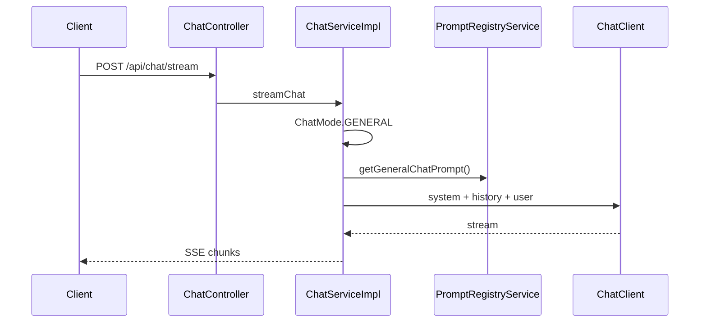
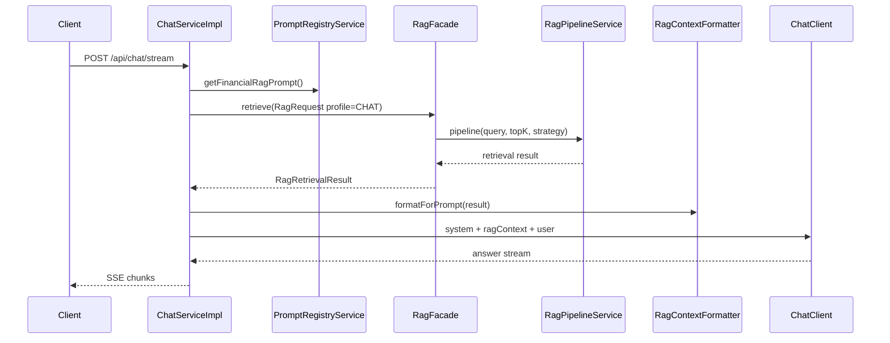
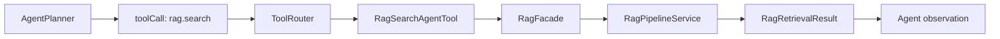
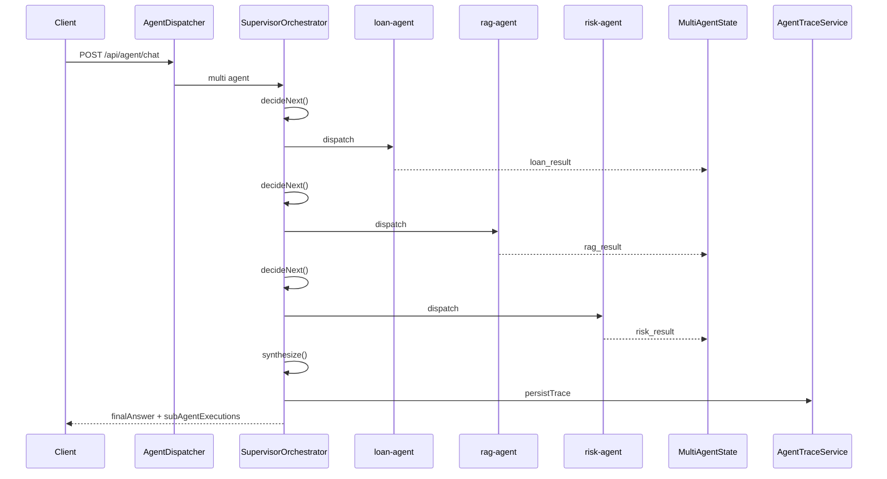
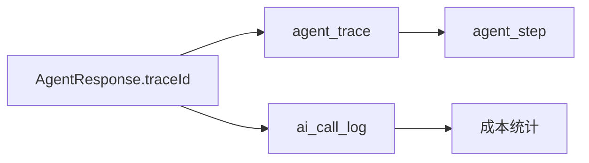

# 核心执行链路示例

本文档用几个典型请求说明当前项目的端到端链路。

## 1. 常规聊天

示例：

```json
{
  "message": "解释一下什么是 RAG",
  "mode": "general"
}
```

链路：



特点：

- 不启用 RAG。
- 不调用业务工具。
- 适合技术解释、普通问答、写作类任务。

## 2. 金融 RAG 问答

示例：

```json
{
  "message": "提前还款有什么规则？",
  "mode": "financial_rag"
}
```

链路：



特点：

- RAG 只通过 `RagFacade` 进入。
- Chat 和 Agent 共享同一套检索、重写、扩展和重排逻辑。
- 无证据时会在 prompt 中明确表达，而不是假装有知识库依据。

## 3. 单 Agent 任务

示例：

```json
{
  "message": "查询 CUST1001 的借款和还款情况，并结合规则评估风险"
}
```

链路：

```mermaid
sequenceDiagram
  participant Client
  participant Controller as AgentController
  participant Dispatcher as AgentDispatcher
  participant Loop as AgentLoopService
  participant Planner as AgentPlanner
  participant Runtime as AgentLlmClient
  participant Tool as AgentToolExecutor
  participant Router as ToolRouter
  participant Trace as AgentTraceService

  Client->>Controller: POST /api/agent/chat
  Controller->>Dispatcher: chat(request)
  Dispatcher->>Loop: single agent
  Loop->>Planner: buildPlan
  Planner->>Runtime: LLM call phase=PLAN
  Runtime-->>Planner: structured plan JSON
  Loop->>Tool: executeWithRetry(toolCall)
  Tool->>Router: execute(toolName,args)
  Router-->>Tool: result
  Tool-->>Loop: observation
  Loop->>Runtime: REFLECT / RESPOND / SELF_CHECK
  Loop->>Trace: persistTrace
  Loop-->>Dispatcher: AgentResponse(traceId, steps)
  Dispatcher-->>Controller: response
  Controller-->>Client: finalAnswer + steps
```

特点：

- LLM 输出由 `AgentStructuredOutputValidator` 校验。
- 每个步骤有 `AgentStepStatus` 和 `AgentFailureReason`。
- `AgentBudgetTracker` 记录 LLM/tool 调用预算。
- `AgentTraceService` 持久化 trace，方便回放。

## 4. Agent 中的 RAG 工具

当 Planner 规划出 `rag.search` 时：



`RagSearchAgentTool` 会把统一检索结果映射为 Agent 现有 observation 格式，保证前端展示和旧工具协议兼容。

## 5. 多 Agent 任务

示例：

```json
{
  "message": "查询 CUST1001 的借款和还款情况，再结合风控规则给出综合风险判断",
  "multiAgent": true
}
```

链路：



特点：

- Supervisor 只负责调度和综合。
- 子 Agent 复用单 Agent 的 Planner、Tool、Reflector、Responder。
- 每个子 Agent 有自己的工具白名单。
- 最终响应包含 `subAgentExecutions` 和全局 `steps`。

## 6. Trace 与成本关联

Agent 内部每次 LLM 调用都会带上当前阶段：

```text
PLAN
REFLECT
REPLAN
RESPOND
SELF_CHECK
SUPERVISOR_DECIDE
SUPERVISOR_SYNTHESIZE
```

`AiCallLoggerAspect` 会把这些阶段写入 `ai_call_log.call_phase`，并通过 `trace_id` 关联 `agent_trace`。



面试讲解时，可以用 `traceId` 从业务结果一路讲到底层模型调用成本。
