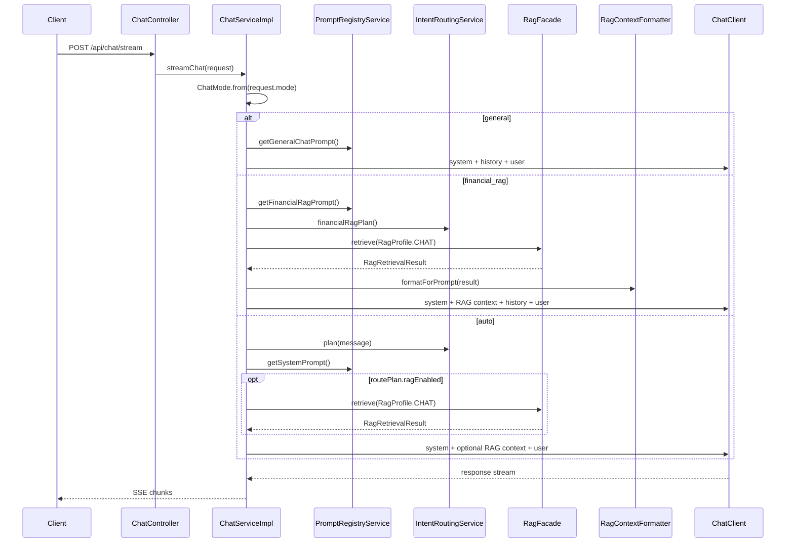

# Chat 指南

本文档说明项目中的 Chat 链路，包括阻塞式响应、SSE 流式响应、会话持久化、模式路由和金融 RAG 注入。

## 1. 接口

| 接口 | 说明 |
|---|---|
| `POST /api/chat` | 阻塞式聊天 |
| `POST /api/chat/stream` | SSE 流式聊天 |
| `GET /api/chat/conversations` | 查询会话列表 |
| `GET /api/chat/{conversationId}/messages` | 查询会话消息 |

Chat 请求核心字段：

| 字段 | 说明 |
|---|---|
| `message` | 用户问题 |
| `conversationId` | 可选，会话 ID |
| `mode` | `general`、`financial_rag`、`auto` |
| `stream` | 是否流式 |

## 2. ChatMode

`ChatMode` 用于明确用户想使用哪类能力：

| 模式 | 行为 |
|---|---|
| `general` | 常规聊天，不启用 RAG，不启用业务工具 |
| `financial_rag` | 金融知识库问答，通过 `RagFacade` 检索证据 |
| `auto` | 兼容旧自动路由，由 `IntentRoutingService` 决定是否启用 RAG 或工具 |

推荐前端明确传入 `mode`，这样可以避免普通问题被金融提示词和知识库误影响。

## 3. 请求流程



## 4. 会话记忆

Chat 链路会持久化会话和消息：

- 新会话自动创建 `conversationId`
- 后续请求携带同一个 `conversationId` 即可续聊
- 流式响应会在 meta 事件中返回会话信息

相关表结构由 `sql/chat_memory.sql` 初始化。

## 5. Prompt 管理

Chat 依赖 Prompt Registry 提供系统提示词：

| promptKey | 用途 |
|---|---|
| `chat.general` | 常规聊天 |
| `chat.financial.rag` | 金融 RAG |
| `system.default` | 自动路由和兼容链路 |

如果数据库尚未初始化 Prompt Registry，`PromptRegistryService` 会使用内置兜底 prompt，避免启动后直接失败。

## 6. 金融 RAG 注入

金融 RAG 现在通过 `RagFacade` 统一实现，不再维护单独的检索链路。

```text
ChatServiceImpl
  -> RagFacade.retrieve(RagRequest.profile=CHAT)
  -> RagContextFormatter.formatForPrompt(...)
  -> ChatClient
```

这样 Chat 和 Agent 的 RAG 检索策略、证据格式、降级行为保持一致。

## 7. SSE 响应

流式接口会返回标准 SSE chunk：

```text
event: meta
data: {"conversationId":"..."}

event: message
data: ...

event: done
data: [DONE]
```

异常时返回 error 事件，前端可以据此展示错误信息。

## 8. 与 Agent 的边界

Chat 用于自然语言问答和知识库问答。需要调用贷款、还款、风险评估等业务工具时，推荐走：

```text
POST /api/agent/chat
```

这样可以得到完整的 `traceId`、执行步骤、预算信息和失败原因。
