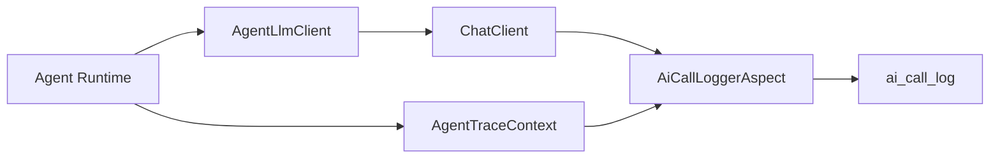
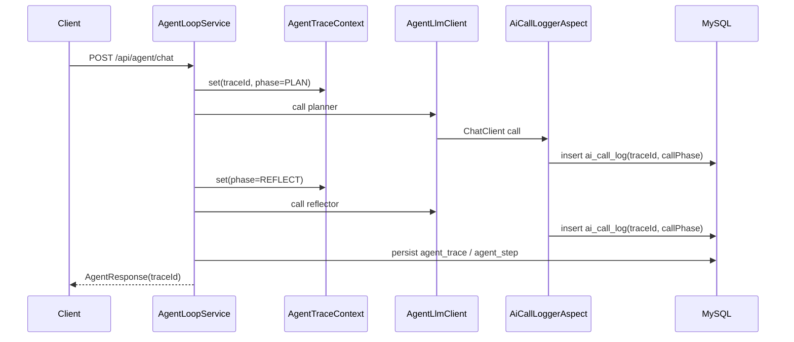

# 成本观测与 Trace

本文档说明项目中的 AI 调用日志、成本统计和 Agent Trace 关联设计。

## 1. 目标

成本观测用于回答三个问题：

1. 一次请求调用了多少次模型？
2. 消耗了多少 token 和费用？
3. 这些模型调用对应 Agent 执行链路中的哪个阶段？

当前通过两类数据完成：

| 数据 | 表 | 说明 |
|---|---|---|
| AI 调用日志 | `ai_call_log` | 记录模型、token、耗时、费用、traceId、callPhase |
| Agent Trace | `agent_trace`, `agent_step` | 记录 Agent 请求头和每个执行步骤 |

## 2. AI 调用日志

`AiCallLoggerAspect` 通过 AOP 拦截 Spring AI 调用，记录：

- provider
- model
- operation type
- prompt/completion token
- latency
- status
- estimated cost
- `trace_id`
- `call_phase`

当调用发生在 Agent Runtime 内部时，`AgentTraceContext` 会向 AOP 暴露当前 `traceId` 和阶段名称。



## 3. Agent Trace

`AgentTraceService` 以 best-effort 方式持久化 Agent 执行结果：

| 表 | 内容 |
|---|---|
| `agent_trace` | traceId、用户问题、最终状态、失败原因、预算摘要 |
| `agent_step` | PLAN、TOOL、REFLECT、REPLAN、SELF_CHECK、RESPOND、DELEGATE 等步骤 |

查询接口：

```text
GET /api/agent/trace/{traceId}
```

前端或面试演示时，可以先运行一次 Agent，再用返回的 `traceId` 查询完整链路。

## 4. 执行链路关联

一次 Agent 请求的观测链路：



## 5. 统计服务

`AiCostStatisticsService` 负责读取 `ai_call_log` 并提供成本统计能力，例如：

- 调用总量
- token 总量
- 费用趋势
- 模型维度统计
- 成功率和失败率

成本看板通过 `/api/cost/*` 接口读取这些统计结果。

## 6. Cache 说明

当前项目可使用 Spring Cache 抽象缓存热点配置和统计结果。具体缓存实现由 Spring Boot 配置决定，文档层不绑定某一个实现。

## 7. 当前边界

当前成本估算基于模型价格配置和 token 计数，适合做工程演示和趋势分析。生产环境中还可以继续增强：

- 与实际账单对账
- 按 `traceId` 聚合一次 Agent 请求的总成本
- 按用户、租户或业务线维度统计
- 将 token 预算和金额预算合并进 `AgentBudgetTracker`
