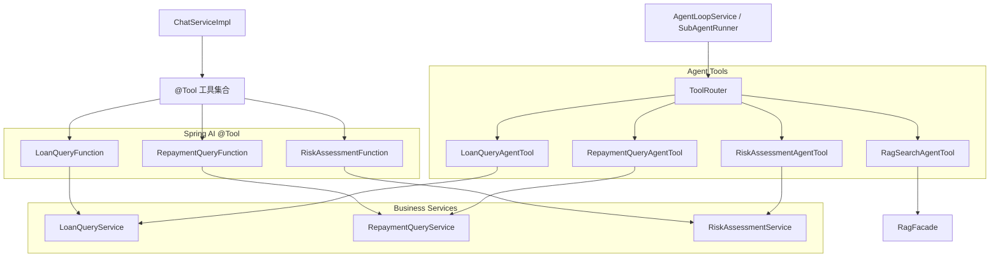

# Function Calling 与业务工具

本文档说明当前项目中的工具调用设计。项目同时保留 Spring AI `@Tool` Function Calling 和自研 Agent Tool 两类适配方式，但业务逻辑统一沉淀在 `service.business`。

## 1. 设计目标

工具调用要解决三个问题：

1. LLM 能访问真实业务数据，而不是凭空回答。
2. 普通 Chat、金融 RAG、Agent 任务的工具边界清楚。
3. 同一份业务能力可以同时服务 Spring AI Function Calling 和 Agent Loop。

## 2. 当前工具分层



## 3. Spring AI `@Tool`

Spring AI Function Calling 用于 Chat 自动路由场景。工具类实现 `AiToolProvider`，具体工具方法使用 `@Tool` 标注。

当前工具：

| 类 | 工具名 | 说明 |
|---|---|---|
| `LoanQueryFunction` | `queryLoanByBizSerial` | 按订单编号查询记录 |
| `LoanQueryFunction` | `loanQueryFunction` | 查询用户借款记录 |
| `RepaymentQueryFunction` | `repaymentQueryFunction` | 查询用户还款记录 |
| `RiskAssessmentFunction` | `riskAssessmentFunction` | 评估用户借款风险 |

`AiModelConfig` 会收集启用的 `AiToolProvider`，但工具是否暴露给某次对话，由 `ChatServiceImpl` 根据路由计划决定。

## 4. Agent Tool

Agent Loop 不依赖模型原生 Function Calling，而是显式规划和执行工具：

```text
AgentPlanner -> toolCalls JSON -> AgentToolExecutor -> ToolRouter -> AgentTool
```

当前 Agent 工具：

| 工具名 | 实现类 | 说明 |
|---|---|---|
| `loan.query` | `LoanQueryAgentTool` | 查询借款记录 |
| `repayment.query` | `RepaymentQueryAgentTool` | 查询还款记录 |
| `risk.assess` | `RiskAssessmentAgentTool` | 风险评估 |
| `rag.search` | `RagSearchAgentTool` | 通过 `RagFacade` 检索知识库证据 |

Agent 工具的优势是可控：可以做工具白名单、重试、超时、失败分类和 trace 记录。

## 5. 工具边界

| 链路 | 工具策略 |
|---|---|
| `mode=general` | 不暴露金融业务工具 |
| `mode=financial_rag` | 不调用业务工具，只使用 `RagFacade` 注入知识库证据 |
| `mode=auto` | 根据 `IntentRoutingService` 路由计划按需暴露 Spring AI `@Tool` |
| `/api/agent/chat` | 由 Agent Planner 规划 `toolCalls`，再由 `ToolRouter` 执行 |
| 多 Agent | 每个 SubAgent 使用自己的 `allowedTools` |

这个边界设计可以避免普通聊天误调用金融工具，也可以避免多 Agent 场景下某个角色越权调用其它角色工具。

## 6. 新增工具建议

新增业务工具时，推荐按这个顺序做：

1. 在 `service.business` 中实现纯业务服务。
2. 如果要支持 Chat Function Calling，新增 `@Tool` 适配器。
3. 如果要支持 Agent Loop，新增 `AgentTool` 适配器并注册到 `ToolRouter`。
4. 在 `IntentRoutingService` 或多 Agent 配置中加入白名单策略。
5. 明确错误返回格式，便于 `AgentFailureReason` 分类。

不要把业务逻辑直接写进 `@Tool` 或 `AgentTool`，否则 Chat 和 Agent 两条链路会再次分叉。

## 7. 面试表达

可以这样总结：

> 我把工具调用拆成三层：业务服务层负责真实业务逻辑，Spring AI `@Tool` 负责 Chat Function Calling 适配，Agent Tool 负责自研 Agent Loop 的显式工具执行。这样既能演示 Spring AI 原生能力，也能展示可控的 Agent Runtime。
