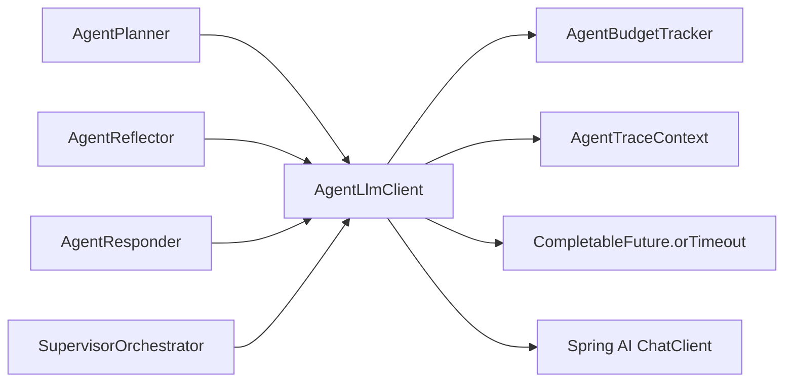

# 多模型接入指南

项目通过 Spring AI 接入 OpenAI-compatible Chat 和 Embedding 模型。Chat、RAG、Agent Runtime 都复用统一的模型配置。

## 1. 当前模型用途

| 用途 | 组件 | 说明 |
|---|---|---|
| 普通 Chat | `ChatServiceImpl` | 生成普通或金融 RAG 回答 |
| RAG 查询重写/重排 | `RagPipelineService` 相关服务 | 查询重写、扩展、rerank |
| Agent 规划/反思/响应 | `AgentLlmClient` | 统一超时、预算和 TraceContext |
| Embedding | `VectorIndexBuilder`, `VectorRetrievalService` | 文档向量化和查询向量化 |

## 2. 环境变量

```bash
export OPENAI_API_KEY=your_api_key
export OPENAI_BASE_URL=https://api.openai.com
export CHAT_MODEL=gpt-4o-mini
export EMBEDDING_MODEL=text-embedding-3-small
```

如果使用兼容 OpenAI 协议的模型服务，只需要调整 `OPENAI_BASE_URL`、`CHAT_MODEL` 和 `EMBEDDING_MODEL`。

## 3. ChatClient 使用方式

项目没有把所有能力都全局挂载到 `ChatClient.Builder`。系统提示词、RAG 上下文和 Agent 阶段上下文都在业务入口处按需组装：

| 调用方 | 上下文来源 |
|---|---|
| `ChatServiceImpl` | ChatMode + PromptRegistry + optional RagFacade |
| `AgentPlanner` | Agent planner prompt |
| `AgentReflector` | observations + reflect prompt |
| `AgentResponder` | observations + final answer/self-check prompt |
| `SupervisorOrchestrator` | 可用 Agent、共享状态、用户问题 |

## 4. AgentLlmClient

Agent 相关 LLM 调用统一经过 `AgentLlmClient`：



这样可以集中处理：

- 单次 LLM 调用超时
- 每轮调用预算
- traceId / callPhase 传播
- 结构化输出前的原始响应记录

## 5. 配置建议

面试或本地演示时，推荐：

- Chat 模型使用稳定的 OpenAI-compatible 文本模型。
- Embedding 模型使用同一服务商的 embedding 模型，避免维度不一致。
- Agent 任务的 `llmTimeoutMs` 和 `requestDeadlineMs` 不要设得太短，否则容易在复杂多 Agent 场景中触发超时。

## 6. 常见问题

### RAG 没有结果

优先检查：

1. Milvus 是否启用并可连接。
2. `EMBEDDING_MODEL` 是否和已有向量索引维度一致。
3. `src/main/resources/knowledge/` 是否有文档。
4. 启动日志中 `VectorIndexBuilder` 是否成功构建索引。

### Agent 经常超时

检查：

1. `app.chat.agent.llm-timeout-ms`
2. `app.chat.agent.request-deadline-ms`
3. 多 Agent 的 `max-supervisor-rounds`
4. 工具调用超时和重试配置

### 成本统计没有 traceId

只有运行在 `AgentTraceContext` 内部的 LLM 调用才会自动带上 `traceId` 和 `callPhase`。普通 Chat 调用仍会记录成本，但不一定有 Agent trace。
