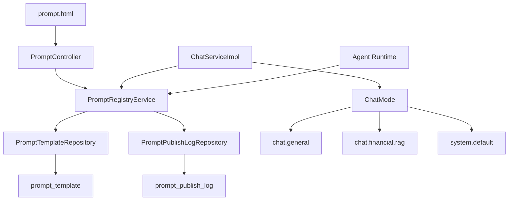
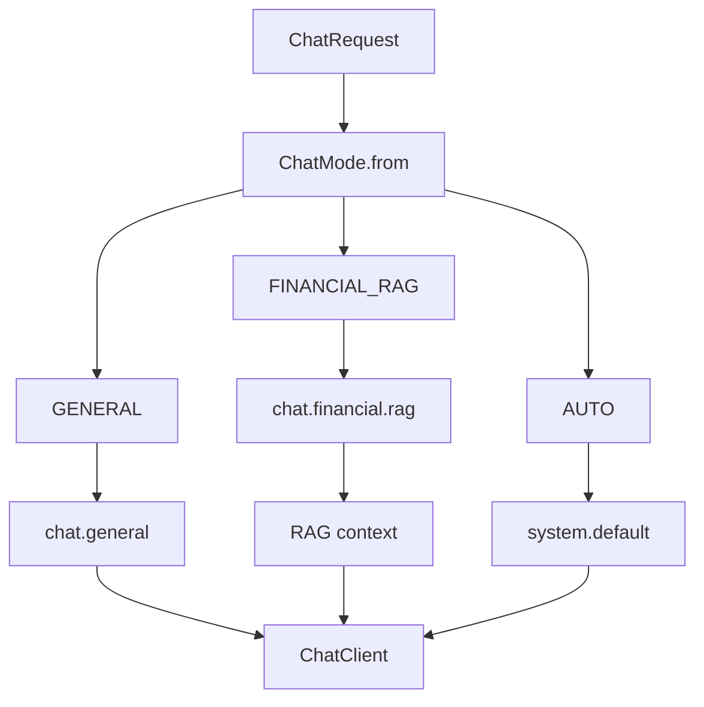

# Prompt 工程与版本治理

本文档说明项目中的 Prompt Registry 设计。当前系统不会把一个全局 system prompt 写死到 `ChatClient.Builder`，而是按 ChatMode、RAG、Agent 阶段动态选择 prompt。

## 1. 设计目标

Prompt 治理解决的是运行时可维护性问题：

1. 提示词从代码中外置，修改不需要重新打包。
2. 支持草稿、发布、回滚，避免直接覆盖线上版本。
3. 不同能力使用不同 prompt，避免普通聊天被金融语境污染。
4. Prompt 变更可以和成本、效果、trace 结合分析。

## 2. Prompt 架构



## 3. 核心 promptKey

| promptKey | 使用场景 |
|---|---|
| `chat.general` | 常规聊天，中立助手，不强行进入金融语境 |
| `chat.financial.rag` | 金融知识库问答，要求基于 RAG 证据回答 |
| `system.default` | `auto` 模式和兼容链路 |
| `rag.qa` | RAG QA 模板和实验 |
| `function.calling` | Function Calling 提示词和实验 |

`chat.general` 和 `chat.financial.rag` 有代码级兜底，数据库尚未初始化时也能保证基本聊天可用。

## 4. 版本状态

Prompt 模板使用最小状态流转：

```text
DRAFT -> ACTIVE -> ARCHIVED
```

约束：

- 同一个 `prompt_key + env` 只能有一个 `ACTIVE` 版本。
- 发布新版本时，旧 ACTIVE 版本归档。
- 回滚本质上是把历史版本重新发布为 ACTIVE。

## 5. 运行时选择逻辑



Agent Runtime 的 planner、reflector、responder、supervisor 当前仍以代码内结构化 prompt 为主。后续如果要进一步治理，可以把这些阶段 prompt 也纳入 registry。

## 6. 管理接口

| 方法 | 路径 | 说明 |
|---|---|---|
| `GET` | `/api/prompts/status` | 查看提示词状态 |
| `GET` | `/api/prompts/registry/active` | 查询当前生效版本 |
| `GET` | `/api/prompts/registry/versions` | 查询版本历史 |
| `POST` | `/api/prompts/registry/drafts` | 创建草稿 |
| `POST` | `/api/prompts/registry/publish` | 发布版本 |
| `POST` | `/api/prompts/registry/rollback` | 回滚版本 |

## 7. 设计取舍

### 为什么不把 prompt 写死在代码里？

金融 RAG、普通 Chat 和 Agent 阶段 prompt 会频繁调整。放在代码里会导致每次修改都要重新发布应用，也不利于回滚和审计。

### 为什么不把所有 prompt 都立即外置？

Chat prompt 直接影响用户体验，优先纳入 Registry。Agent 阶段 prompt 和 JSON schema 强绑定，外置前需要先定义好版本兼容策略，否则容易出现 prompt 与解析器不一致的问题。

### 为什么保留代码级兜底？

本项目用于本地演示和求职展示，数据库未初始化时也应该能启动并演示核心能力。代码级兜底只用于可用性保障，正式环境仍以数据库 ACTIVE 版本为准。

## 8. 面试表达

可以这样总结：

> Prompt Registry 的价值不是“把提示词放进数据库”这么简单，而是把提示词变成可治理资产：有版本、有发布、有回滚、有环境隔离，并且和 ChatMode 解耦，避免不同 AI 能力互相污染。
