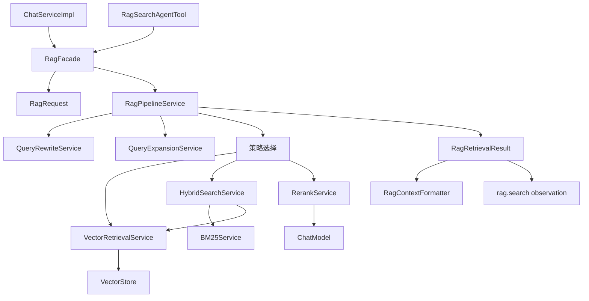
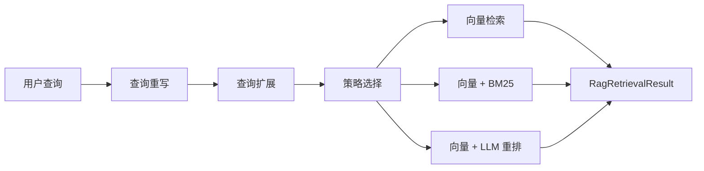
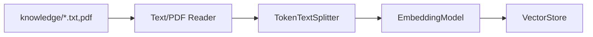

# RAG 指南

本文档说明当前项目中的 RAG 设计。当前生产链路不再暴露独立 RAG 调试接口，RAG 被封装为内部能力，由 `RagFacade` 统一供 Chat 和 Agent 使用。

## 1. 设计目标

统一 RAG 的目标是解决两个问题：

1. Chat 和 Agent 不再各自维护一套检索链路。
2. RAG 结果可以统一表达为结构化证据，方便注入 Chat prompt 或作为 Agent tool observation。

当前生产入口：

| 使用方 | 调用方式 | 说明 |
|---|---|---|
| Chat 金融 RAG | `ChatServiceImpl -> RagFacade` | 检索知识库证据后注入 prompt |
| Agent 工具 | `RagSearchAgentTool -> RagFacade` | 返回结构化检索结果，作为 `rag.search` observation |

## 2. 总体流程



## 3. 核心模型

### `RagRequest`

`RagRequest` 是统一检索请求，包含：

- `query`
- `conversationId`
- `topK`
- `similarityThreshold`
- `profile`
- `documentType`

其中 `profile` 当前用于区分调用来源：

- `CHAT`
- `AGENT`
- `DEBUG`

### `RagRetrievalResult`

`RagRetrievalResult` 是统一检索结果，包含：

- `originalQuery`
- `rewrittenQuery`
- `expandedQuery`
- `strategy`
- `transformationSummary`
- `documents`
- `empty`
- `degraded`
- `reason`

`documents` 内部使用 `RagDocumentResult`，包含文档内容、metadata 和 score。

## 4. Chat 如何使用 RAG

金融 RAG 模式下，`ChatServiceImpl` 会执行：

```text
ChatRequest(mode=financial_rag)
  -> IntentRoutingService.financialRagPlan()
  -> RagFacade.retrieve(...)
  -> RagContextFormatter.formatForPrompt(...)
  -> ChatClient
```

注入 prompt 的内容包含：

- 检索策略
- 证据片段
- 文件名、类型等 metadata
- 无证据时的明确降级说明

这样模型回答时会优先依据知识库证据，而不是凭空生成金融规则。

## 5. Agent 如何使用 RAG

Agent 中的 `rag.search` 工具由 `RagSearchAgentTool` 实现：

```text
AgentLoopService
  -> ToolRouter
  -> RagSearchAgentTool
  -> RagFacade.retrieve(...)
  -> PipelineSearchResultDTO
```

`AgentPolicyEnforcer` 仍会在风险评估类问题中强制补充 `rag.search`，从而保证风险判断有知识库证据。

## 6. RAG Pipeline

`RagPipelineService` 负责具体检索策略：

1. 查询重写：`QueryRewriteService`
2. 查询扩展：`QueryExpansionService`
3. 策略选择：`VECTOR_ONLY`、`HYBRID_SEARCH`、`VECTOR_WITH_RERANK`、`HYBRID_WITH_RERANK`
4. 检索执行：向量检索、BM25 混合检索或 LLM rerank



## 7. 知识库构建

知识库文档位于：

```text
src/main/resources/knowledge/
```

启动后由 `VectorIndexBuilder` 异步读取、切分、向量化并写入 `VectorStore`。



默认向量存储配置为 Milvus；当 Milvus 未启用时，`FallbackVectorStoreConfig` 会提供空结果降级实现，保证应用能启动，但 RAG 不会返回真实证据。

## 8. 当前边界

当前 RAG 架构已经完成生产入口统一，但仍保留几个演进点：

- `RagProfile` 目前主要表达调用来源，后续可驱动不同检索策略。
- `similarityThreshold` 已在请求模型中预留，后续可进一步传入 pipeline 内部所有检索阶段。
- `HYBRID_WITH_RERANK` 当前仍是扩展点，可继续补齐混合检索后的重排。
