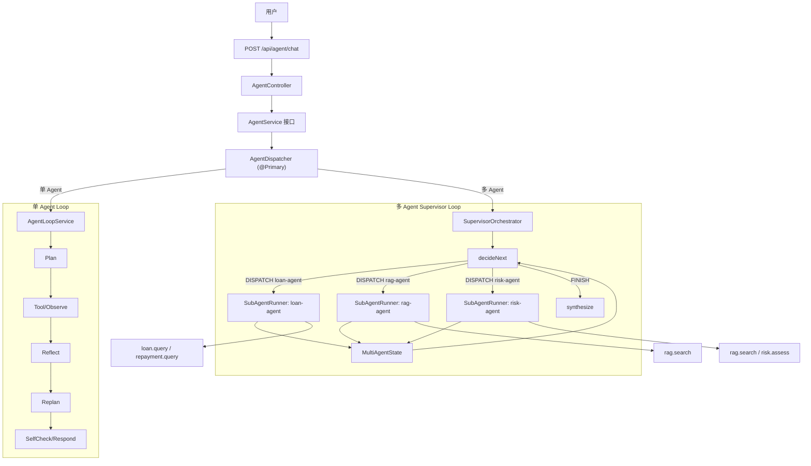
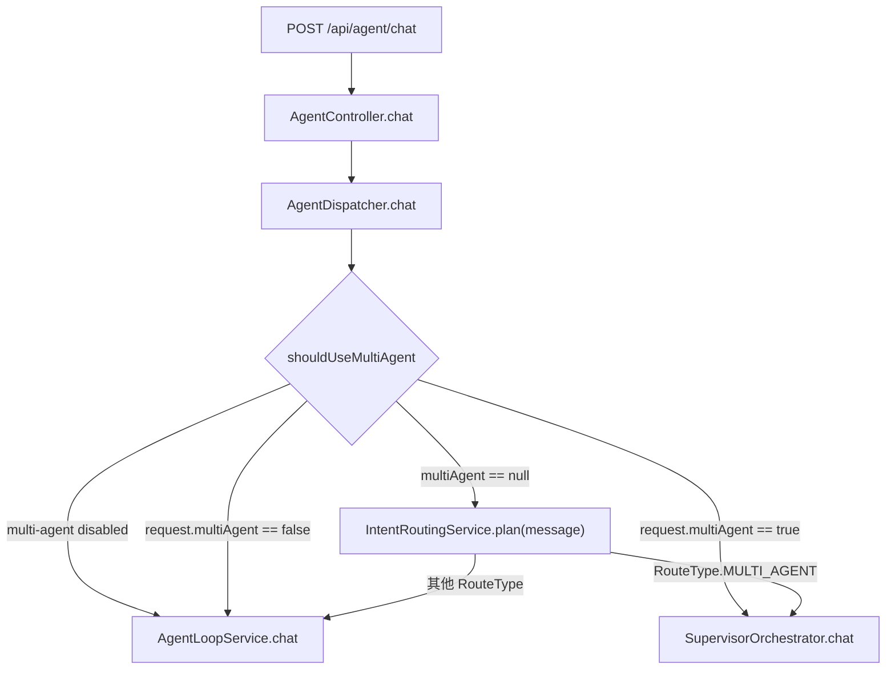
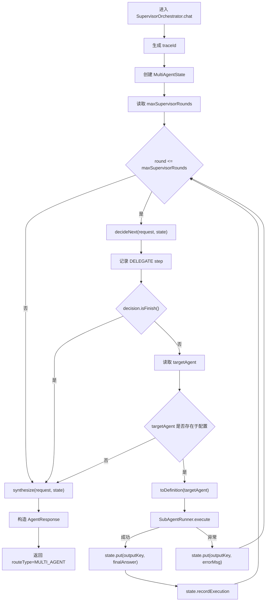
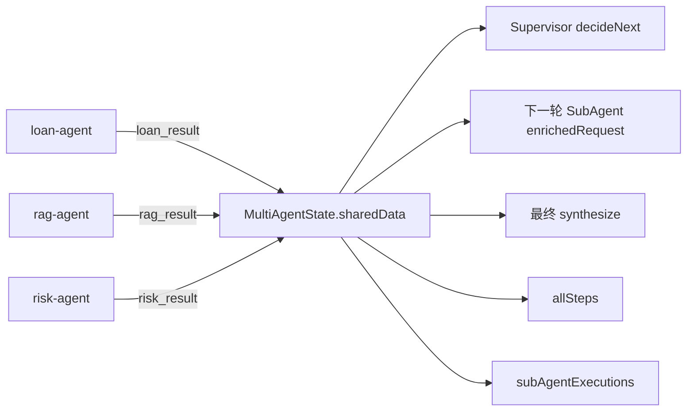
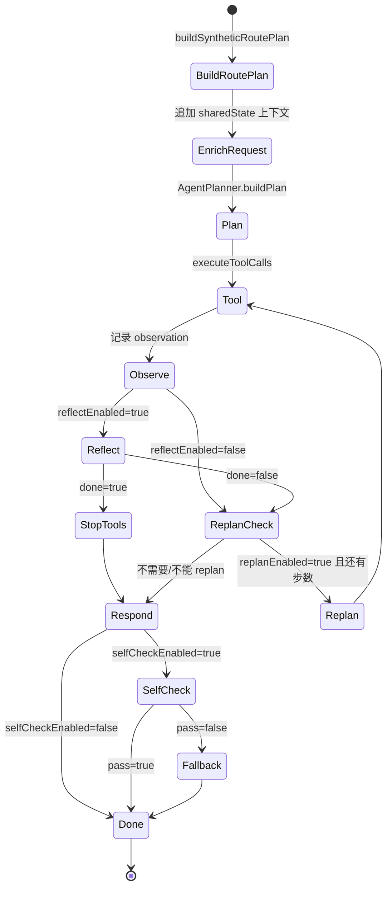
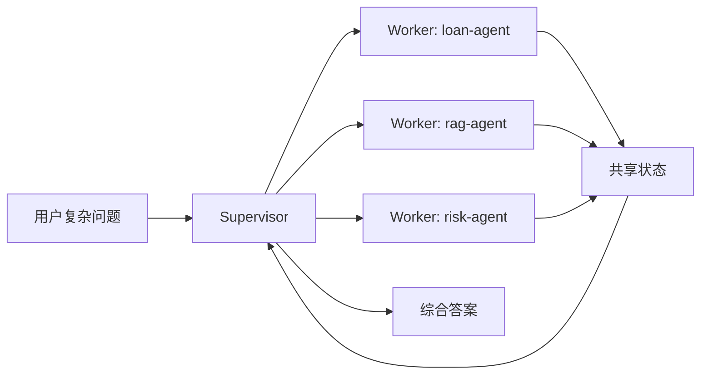
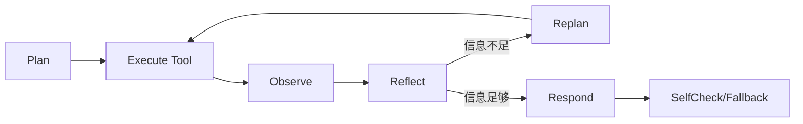
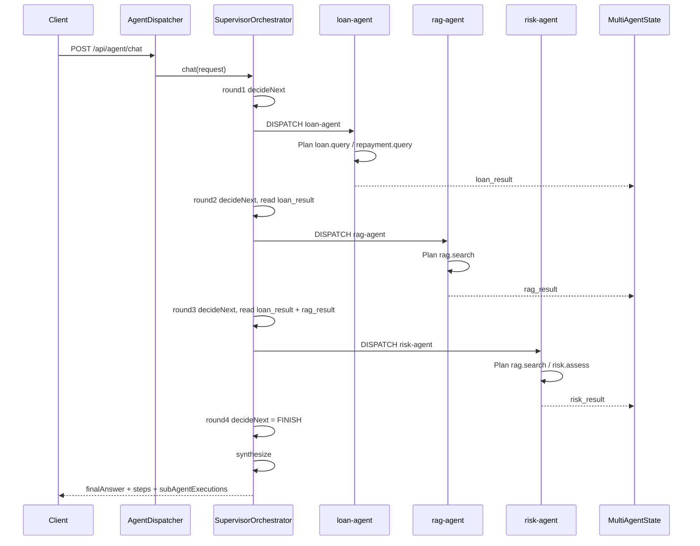
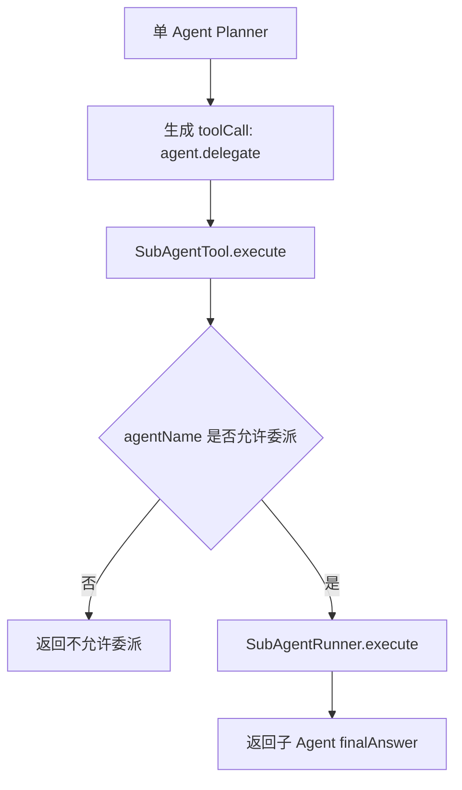

# 多 Agent Supervisor 架构面试讲解文档

本文档聚焦 `com.example.aidevelop.agent.multi.SupervisorOrchestrator#chat` 的设计与执行流程，目标是能在面试或项目复盘中清晰说明：为什么需要多 Agent、请求如何进入多 Agent、Supervisor 如何调度子 Agent、每个 Agent 能调用哪些工具，以及这套实现和 AI Agent 领域常见的 `plan-and-execute-replan`、`supervisor-worker`、`agent-as-tool` 等架构模式之间的关系。

## 1. 一句话概述

这个项目里的多 Agent 设计可以概括为：

> 外层使用 `SupervisorOrchestrator` 做多 Agent 调度，内层每个 `SubAgentRunner` 复用单 Agent 的 Plan -> Tool/Observe -> Reflect -> Replan -> SelfCheck -> Respond 流程。Supervisor 负责“下一步该派谁”，SubAgent 负责“怎么调用工具把子任务完成”，最后 Supervisor 再综合多个子 Agent 的结果生成最终回答。

这不是简单地把多个工具暴露给一个大模型，而是把复杂问题拆成多个角色明确、工具隔离、结果可追踪的子 Agent，让系统在金融助贷场景中可以同时处理业务数据查询、知识库规则检索和风险评估。

## 2. 适合面试表达的设计背景

单 Agent 可以解决“查一类数据然后回答”的问题，比如查询某个用户的借款记录。但当问题变成：

> 查询 CUST1001 的借款和还款情况，再结合知识库风控规则，综合评估风险。

它同时包含三类能力：

| 能力 | 数据来源 | 典型工具 | 适合的 Agent |
|---|---|---|---|
| 借款/还款查询 | 业务数据库或业务服务 | `loan.query`、`repayment.query` | `loan-agent` |
| 风控规则检索 | 向量知识库/RAG 管道 | `rag.search` | `rag-agent` 或 `risk-agent` |
| 风险判断 | 业务规则服务 + RAG 证据 | `risk.assess`、`rag.search` | `risk-agent` |

如果只靠一个 Agent，一方面 prompt 会变得很复杂，另一方面工具权限也过宽。多 Agent 的价值在于：

1. **职责分离**：不同 Agent 负责不同专业域，提示词更短、更明确。
2. **工具隔离**：每个 Agent 只拿到自己的 `allowed-tools`，降低误调用和越权调用风险。
3. **动态编排**：Supervisor 根据已有结果决定下一步，而不是写死固定链路。
4. **可观测性**：最终响应返回 `steps` 和 `subAgentExecutions`，可以看到每一轮决策、工具调用和子 Agent 输出。
5. **可扩展性**：新增 Agent 主要改 YAML 配置，不需要重写核心编排代码。

## 3. 总体架构



核心类分工：

| 类 | 角色 | 重点职责 |
|---|---|---|
| `AgentDispatcher` | 入口分流器 | 根据 `request.multiAgent` 或 `IntentRoutingService.plan()` 决定走单 Agent 还是多 Agent |
| `SupervisorOrchestrator` | 多 Agent 编排器 | 维护外层 supervisor 循环，决定派哪个子 Agent，并最终综合答案 |
| `SubAgentRunner` | 子 Agent 执行器 | 复用 Planner/Executor/Reflector/Responder，执行一个专业 Agent |
| `MultiAgentState` | 共享状态/黑板 | 保存各子 Agent 输出、全局 steps、子 Agent 执行记录 |
| `MultiAgentProperties` | 配置绑定 | 从 `application.yml` 加载 Agent 定义、提示词、工具白名单和开关 |
| `SubAgentTool` | Agent-as-Tool 适配器 | 允许单 Agent 把子 Agent 当普通工具调用 |

## 4. 请求入口与多 Agent 触发

`AgentController` 注入的是 `AgentService`，但 `AgentDispatcher` 标记了 `@Primary`，所以 `/api/agent/chat` 的请求会先进入 `AgentDispatcher`。



触发规则有三层：

1. **总开关**：`app.chat.multi-agent.enabled=false` 时永远回退到单 Agent。
2. **请求显式指定**：`AgentRequest.multiAgent=true` 强制多 Agent，`false` 强制单 Agent。
3. **自动路由判断**：未指定时由 `IntentRoutingService` 判断，如果命中多 Agent 关键词，或同时命中工具类关键词和 RAG 类关键词，则返回 `RouteType.MULTI_AGENT`。

这里体现了工程上的一个取舍：多 Agent 比单 Agent 成本更高、链路更长，所以只在复杂跨域问题上启用。

## 5. `SupervisorOrchestrator#chat` 执行流程

`SupervisorOrchestrator#chat` 是多 Agent 的核心外层循环。它本身不直接调用业务工具，而是每轮让 LLM 输出一个结构化决策：

```json
{"action":"DISPATCH","targetAgent":"loan-agent","reason":"先查询用户借款和还款数据"}
```

或者：

```json
{"action":"FINISH","reason":"已有结果足够生成综合回答"}
```

完整流程如下：



这段流程可以拆成 6 个动作：

1. **初始化**：生成 `traceId`，创建 `MultiAgentState`。
2. **Supervisor 决策**：`decideNext()` 把可用 Agent、已有结果、用户问题拼成 prompt，让模型返回 JSON。
3. **记录轨迹**：每轮 supervisor 决策都会记录一个 `AgentStep`，`actionType=DELEGATE`，`toolName=supervisor`。
4. **执行子 Agent**：如果 action 是 `DISPATCH`，就根据 `targetAgent` 找到配置，调用 `SubAgentRunner.execute()`。
5. **写入共享状态**：子 Agent 的 `finalAnswer` 按 `outputKey` 写入 `MultiAgentState`，后续 supervisor 和子 Agent 都能看到。
6. **综合回答**：循环结束后调用 `synthesize()`，多 Agent 时让 LLM 基于所有结果生成最终回答。

## 6. Supervisor 决策 Prompt

Supervisor 的提示词来自 `application.yml`：

```yaml
supervisor-system-prompt: |
  你是多 Agent 调度器。根据用户问题和已有结果决定下一步。
  仅返回 JSON：{"action":"DISPATCH","targetAgent":"<name>","reason":"..."} 或 {"action":"FINISH","reason":"..."}
  规则：
  1) 每次只 DISPATCH 一个 Agent
  2) 不要重复 DISPATCH 已完成的 Agent（除非结果不足）
  3) 所有必要信息收集完毕后输出 FINISH
```

`decideNext()` 运行时还会追加三类动态上下文：

| 上下文 | 来源 | 作用 |
|---|---|---|
| 可用 Agent 列表 | `multiAgentProperties.getAgents()` | 告诉 supervisor 有哪些专家可以调度 |
| 已有结果 | `state.buildContextSummary()` | 告诉 supervisor 已经拿到了什么，不要重复调用 |
| 用户问题 | `request.getMessage()` | 作为本轮调度目标 |

面试时可以强调：这里不是让模型随便聊天，而是强制输出 JSON 决策，用 `parseSupervisorDecision()` 解析；如果解析失败或调用异常，就保守返回 `FINISH`，避免无限循环。

## 7. `MultiAgentState`：共享黑板设计

`MultiAgentState` 是外层多 Agent 的共享状态，类似多 Agent 系统里的 blackboard/shared memory。



它保存三类信息：

| 字段 | 类型 | 用途 |
|---|---|---|
| `sharedData` | `ConcurrentHashMap<String, Object>` | 保存各子 Agent 的输出，例如 `loan_result`、`risk_result` |
| `allSteps` | `List<AgentStep>` | 汇总 supervisor 和所有子 Agent 的执行步骤 |
| `executions` | `List<SubAgentExecution>` | 保存每个子 Agent 的响应、耗时和 outputKey |

`buildContextSummary()` 会把共享结果整理成文本，超过 500 字会截断。这个上下文会被用于：

1. Supervisor 下一轮决策。
2. 子 Agent 的 `enrichedRequest`。
3. 最终 `synthesize()` 综合回答。

## 8. 子 Agent 执行流程

每个子 Agent 进入 `SubAgentRunner.execute()` 后，会复用单 Agent 的核心组件：

| 组件 | 职责 |
|---|---|
| `AgentPlanner` | 让 LLM 生成结构化 `toolCalls` |
| `AgentToolExecutor` | 带重试地执行工具调用 |
| `AgentReflector` | 判断 observation 是否足够 |
| `AgentResponder` | 基于 observation 生成最终回答，并可做 self-check |

子 Agent 内部流程：



注意这里有一个重要实现点：`SubAgentRunner` 不直接用全局 `IntentRoutingService` 重新规划业务路由，而是通过 `buildSyntheticRoutePlan()` 构造一个 `RoutePlan(TOOL_ONLY)`。这个设计的含义是：子 Agent 的能力边界由 `SubAgentDefinition.allowedTools` 决定，而不是再让路由层动态放开一批工具。

## 9. 当前子 Agent 配置

配置位置：`src/main/resources/application.yml` 的 `app.chat.multi-agent.agents`。

| Agent | 职责 | System Prompt 摘要 | 可调用工具 | maxSteps | Reflect | Replan | SelfCheck | outputKey |
|---|---|---|---|---:|---|---|---|---|
| `risk-agent` | 风险评估专家 | 基于借款数据和知识库规则，为用户提供风险分析，必须引用 RAG 证据 | `rag.search`、`risk.assess` | 2 | 开 | 关 | 开 | `risk_result` |
| `loan-agent` | 借款查询专家 | 精确查询用户借款和还款记录并清晰呈现 | `loan.query`、`repayment.query` | 2 | 开 | 关 | 关 | `loan_result` |
| `rag-agent` | 知识检索专家 | 从知识库中精确检索规则和政策信息 | `rag.search` | 1 | 关 | 关 | 关 | `rag_result` |

对应配置：

```yaml
agents:
  risk-agent:
    description: "风险评估专家，负责用户信用风险分析"
    system-prompt: |
      你是风险评估专家。基于借款数据和知识库规则，为用户提供风险分析。
      必须引用 RAG 证据支持结论。
    allowed-tools:
      - rag.search
      - risk.assess
    max-steps: 2
    reflect-enabled: true
    replan-enabled: false
    self-check-enabled: true
    temperature: 0.3
    max-tokens: 800
    output-key: risk_result

  loan-agent:
    description: "借款查询专家，负责贷款记录查询与解读"
    system-prompt: |
      你是借款查询助手。精确查询用户借款和还款记录并清晰呈现。
    allowed-tools:
      - loan.query
      - repayment.query
    max-steps: 2
    reflect-enabled: true
    replan-enabled: false
    self-check-enabled: false
    temperature: 0.5
    max-tokens: 600
    output-key: loan_result

  rag-agent:
    description: "知识检索专家，负责从规则政策库中检索相关信息"
    system-prompt: |
      你是金融产品知识专家。从知识库中精确检索规则和政策信息。
    allowed-tools:
      - rag.search
    max-steps: 1
    reflect-enabled: false
    replan-enabled: false
    self-check-enabled: false
    temperature: 0.2
    max-tokens: 500
    output-key: rag_result
```

面试时可以这样解释三个 Agent 的设计：

- `loan-agent` 负责“事实数据”，只查借款和还款，避免让它直接做风险判断。
- `rag-agent` 负责“规则依据”，只检索知识库，不碰用户业务数据。
- `risk-agent` 负责“综合判断”，它既能查 RAG 证据，也能调用风险评估工具，但会启用 self-check 保证风险类回答更稳健。

## 10. 当前工具清单

工具都实现了 `AgentTool` 接口，并由 `ToolRouter` 延迟注册和统一执行。

| 工具名 | 实现类 | 参数 | 作用 |
|---|---|---|---|
| `rag.search` | `RagSearchAgentTool` | `query`、`conversationId`、`topK` | 调用 RAG 管道做知识库语义检索 |
| `loan.query` | `LoanQueryAgentTool` | `userNo`、`status` | 查询用户借款记录 |
| `repayment.query` | `RepaymentQueryAgentTool` | `userNo`、`status` | 查询用户还款记录 |
| `risk.assess` | `RiskAssessmentAgentTool` | `userNo` | 评估用户风险等级 |
| `agent.delegate` | `SubAgentTool` | `agentName`、`query`、`context` | 在单 Agent 中把子 Agent 当工具调用 |

工具安全边界有两层：

1. **子 Agent 白名单**：`SubAgentDefinition.allowedTools()` 限定 Planner 能看到哪些工具描述。
2. **全局工具白名单**：`ToolRouter.isAllowed()` 会检查 `app.chat.agent.allowed-tools`，防止模型或规划阶段生成未授权工具名。

## 11. 和 `plan-and-execute-replan` 的关系

这套实现有两层 Agent 模式，容易混在一起。

### 11.1 外层：Supervisor-Worker

外层是典型的 **Supervisor-Worker Multi-Agent**：



Supervisor 不亲自查数据，也不亲自调用 `loan.query` 或 `risk.assess`。它只做两件事：

1. 根据用户问题和已有结果选择下一个 Agent。
2. 最后基于所有 Agent 的输出做综合。

### 11.2 内层：Plan -> Execute -> Reflect -> Replan

每个子 Agent 内部是单 Agent loop：



这里的 `Plan` 是 `AgentPlanner.buildPlan()`，会让 LLM 输出结构化 `toolCalls`。`Execute` 是 `AgentToolExecutor.executeWithRetry()`。`Reflect` 判断观察结果是否足够。`Replan` 在证据不足时补充工具调用。`SelfCheck` 在最终回答前做质量检查。

### 11.3 本项目的特点

本项目不是“一次性先生成完整多 Agent 计划，再顺序执行”，而是：

> Supervisor 每轮只决定一个子 Agent；子 Agent 执行完后把结果写回共享状态；Supervisor 再基于新状态重新决策。

这更接近 **iterative supervise-dispatch-replan**，好处是能根据真实执行结果调整下一步，坏处是 LLM 调用次数更多，所以必须有 `maxSupervisorRounds` 兜底。

## 12. 示例链路：综合评估用户风险

示例请求：

```json
{
  "message": "帮我查询 CUST1001 的借款和还款情况，再结合知识库规则综合评估风险",
  "multiAgent": true
}
```

可能的执行过程：



这条链路里的关键点：

- `loan-agent` 先拿到用户业务数据。
- `rag-agent` 或 `risk-agent` 补充风控规则证据。
- `risk-agent` 做最终风险判断，并且开启 self-check。
- `SupervisorOrchestrator.synthesize()` 把 `loan_result`、`rag_result`、`risk_result` 合成用户能读懂的最终答案。

## 13. 响应结构与可观测性

多 Agent 最终返回的 `AgentResponse` 包含：

| 字段 | 含义 |
|---|---|
| `traceId` | 一次请求的全局追踪 ID |
| `routeType` | 固定为 `MULTI_AGENT` |
| `finalAnswer` | 最终综合回答 |
| `completed` | 是否完成 |
| `executedSteps` | 全部步骤数 |
| `responseTimeMs` | 总耗时 |
| `steps` | supervisor 决策、子 Agent plan/tool/reflect/respond 的完整步骤 |
| `subAgentExecutions` | 每个子 Agent 的响应、outputKey、耗时 |

典型 steps 会长这样：

```text
1. DELEGATE supervisor round=1; action=DISPATCH; target=loan-agent
2. PLAN     loan-agent 生成 loan.query / repayment.query
3. TOOL     loan.query 执行
4. TOOL     repayment.query 执行
5. REFLECT  loan-agent 判断信息是否足够
6. RESPOND  loan-agent 输出 loan_result
7. DELEGATE supervisor round=2; action=DISPATCH; target=risk-agent
...
```

面试时可以强调：这比普通 Chat 响应更适合排查生产问题，因为不仅能看到最终答案，还能看到模型为什么调某个 Agent、工具是否失败、哪个 Agent 耗时最长。

## 14. Agent-as-Tool 模式

除了 Supervisor 编排，本项目还支持轻量的 **Agent-as-Tool**。



配置：

```yaml
agent-as-tool:
  enabled: true
  tool-name: agent.delegate
  delegatable-agents:
    - risk-agent
    - loan-agent
    - rag-agent
```

它和 Supervisor 编排的区别：

| 模式 | 适用场景 | 谁决定调用子 Agent | 是否有多轮全局调度 |
|---|---|---|---|
| Supervisor 编排 | 明确复杂跨域任务 | `SupervisorOrchestrator` | 有 |
| Agent-as-Tool | 单 Agent 偶尔需要专家能力 | 普通 `AgentPlanner` | 没有，像普通工具一样调用一次 |

## 15. 容错与边界控制

这套多 Agent 设计里有几类重要保护：

| 风险 | 对应设计 |
|---|---|
| Supervisor 无限调度 | `maxSupervisorRounds` 限制最大轮次 |
| Supervisor 输出非 JSON | `parseSupervisorDecision()` 解析失败后返回 `FINISH` |
| Supervisor 指向不存在的 Agent | 校验 `multiAgentProperties.getAgents().containsKey(targetAgent)` |
| 子 Agent 工具越权 | `allowedTools` + `ToolRouter` 全局白名单 |
| 工具调用失败 | `AgentToolExecutor.executeWithRetry()` 重试，失败 observation 会进入步骤记录 |
| 风险评估缺少 RAG 证据 | `AgentPolicyEnforcer` 强制风险意图补 `rag.search`，`AgentResponder.selfCheck()` 再校验 |
| 最终答案不可靠 | `selfCheck` 不通过时走 `buildFallbackAnswer()` |

这里可以提到一个当前实现边界：`supervisor-timeout-ms` 已经在配置中存在，但 `SupervisorOrchestrator#chat` 当前主要依赖 `maxSupervisorRounds` 控制循环轮次，并没有在方法里显式做总超时中断。如果面试官追问生产化优化，可以说后续可以把这个配置用于外层 deadline 检查。

## 16. 如何扩展新的子 Agent

新增一个子 Agent 通常分三步：

1. **确认职责边界**：它是查数据、查知识、做判断，还是做生成？
2. **配置 Agent**：在 `application.yml` 中添加 `agents.<name>`。
3. **配置工具**：如果复用已有工具，只加 `allowed-tools`；如果需要新工具，实现 `AgentTool` 并注册为 Spring Bean。

示例：新增催收建议 Agent。

```yaml
collection-agent:
  description: "催收策略专家，负责结合还款记录和规则给出催收建议"
  system-prompt: |
    你是催收策略专家。请基于用户还款记录和知识库规则，给出合规、稳健的催收建议。
  allowed-tools:
    - repayment.query
    - rag.search
  max-steps: 2
  reflect-enabled: true
  replan-enabled: false
  self-check-enabled: true
  temperature: 0.3
  max-tokens: 800
  output-key: collection_result
```

如果需要新增工具：

```java
@Component
public class CollectionAdviceAgentTool implements AgentTool {
    @Override
    public String name() {
        return "collection.advice";
    }

    @Override
    public Object execute(Map<String, Object> args) {
        // 调用业务服务，返回结构化催收建议
    }
}
```

然后把 `collection.advice` 加入对应 Agent 的 `allowed-tools`，并确保全局 `app.chat.agent.allowed-tools` 允许它。

## 17. 面试阐述模板

可以按下面这段话来讲：

> 我们的 Agent 能力分成单 Agent 和多 Agent 两层。普通查询走 `AgentLoopService`，内部是 Plan、Tool、Observe、Reflect、Replan、SelfCheck、Respond。复杂跨域问题会由 `AgentDispatcher` 路由到 `SupervisorOrchestrator`。Supervisor 本身不直接调业务工具，而是每轮基于用户问题、可用 Agent 和已有结果，让 LLM 输出一个 JSON 决策，决定派 `loan-agent`、`rag-agent` 还是 `risk-agent`。每个子 Agent 都通过 YAML 配置自己的 system prompt、工具白名单、最大步数和自检策略。子 Agent 执行后把结果写入 `MultiAgentState`，Supervisor 再根据共享状态继续调度或结束。最后 `synthesize` 基于所有子 Agent 结果生成综合回答。这个设计本质上是外层 Supervisor-Worker，多轮迭代调度；内层每个 Worker 是 plan-and-execute-replan。它的优势是职责清晰、工具隔离、可观测性好，也便于通过配置扩展新的专业 Agent。

如果面试官继续问“为什么不用一个 Agent 调所有工具”，可以回答：

> 一个 Agent 调所有工具实现简单，但复杂问题里 prompt 会臃肿，工具权限过大，模型容易误调工具，也不利于定位问题。多 Agent 把工具集收敛到角色维度，比如 loan-agent 只能查借款还款，rag-agent 只能查知识库，risk-agent 才能做风险评估。这样既符合最小权限原则，也让 trace 更清楚：哪个 Agent 做了什么、用了什么证据、耗时多少，都能在响应里看到。

如果面试官问“这和 LangGraph/Supervisor Agent 有什么关系”，可以回答：

> 思路类似 LangGraph 的 supervisor-worker 或 graph state：都有共享状态、节点执行和条件路由。区别是本项目没有引入图框架，而是在 Spring Boot 里用 `SupervisorOrchestrator`、`SubAgentRunner` 和 `MultiAgentState` 手写了一个轻量版本。这样更容易和已有 Spring AI、业务工具、配置体系集成，也方便学习和演示 Agent 架构的核心机制。

## 18. 推荐走读顺序

面试前可以按这个顺序看代码：

1. `AgentDispatcher#chat`：理解单 Agent 和多 Agent 如何分流。
2. `IntentRoutingService#plan`：理解什么问题会被识别为 `MULTI_AGENT`。
3. `SupervisorOrchestrator#chat`：理解 supervisor 外层循环。
4. `SupervisorOrchestrator#decideNext`：理解 LLM 如何做结构化调度决策。
5. `SubAgentRunner#execute`：理解子 Agent 如何复用单 Agent loop。
6. `MultiAgentState#buildContextSummary`：理解共享状态如何传递。
7. `application.yml` 的 `app.chat.multi-agent`：理解 Agent 配置、提示词、工具白名单。
8. `ToolRouter` 和各 `AgentTool`：理解工具注册、工具描述和授权边界。

## 19. 当前实现边界与可优化点

这套实现已经覆盖多 Agent 的核心机制，但还有一些生产化优化空间：

| 优化点 | 说明 |
|---|---|
| 总超时控制 | 使用 `supervisor-timeout-ms` 做外层 deadline，防止多轮 LLM 调用超时 |
| 去重策略 | `MultiAgentState` 可记录已完成 Agent，提示词之外再用代码避免重复调度 |
| 结构化结果 | 子 Agent 输出目前主要是文本，可进一步定义结构化 schema |
| 并行调度 | 当前每轮只派一个 Agent，未来可对互不依赖的 Agent 并行执行 |
| 更强状态图 | 如果流程继续复杂化，可以演进到 LangGraph 风格的显式状态机 |
| 成本预算 | 按 Agent 配置 token/cost 预算，超过预算提前终止或降级 |

总体上，本项目的多 Agent 设计适合用来展示企业 AI 应用里从“单次聊天”到“可编排、可治理、可观测 Agent 系统”的演进过程。
